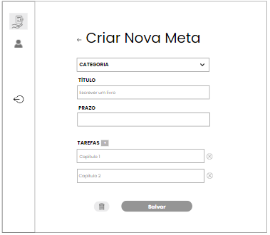

# ORGANIZER

`ANÁLISE E DESENVOLVIMENTO DE SISTEMAS`

`PROJETO DE DESENVOLVIMENTO DE UMA APLICAÇÃO INTERATIVA`

`2° SEMESTRE`

O projeto visa desenvolver um gerenciador de tarefas simples, prático e útil, focado em ajudar as pessoas a organizarem suas atividades.

## Integrantes

* Irene Aparecida Couto Ferraz
* Maria de Lourdes Monteiro da Silva
* Matheus Soares da Silva
* Talita Fernandes Silva

## Orientador

* Bernardo Jeunon de Alencar

## Instruções de utilização

Para utilizar o sistema de gerenciamento de tarefas, é necessário primeiro realizar o cadastro e, em seguida, fazer login no site. Você pode acessar a aplicação por meio do link:https://gerencietarefas.azurewebsites.net/.</br>

Antes de começar, certifique-se de criar uma conta preenchendo as informações necessárias e, após o cadastro, você poderá fazer login com suas credenciais. O sistema oferece uma experiência personalizada, permitindo que você gerencie suas tarefas de forma eficaz e segura.

# ÍNDICE

<ol>
	
<li><a href="https://github.com/ICEI-PUC-Minas-PMV-ADS/pmv-ads-2023-2-e2-proj-int-t6-organizer/blob/main/README.md#documentacao"> Documentação</a></li>

<li><a href="https://github.com/ICEI-PUC-Minas-PMV-ADS/pmv-ads-2023-2-e2-proj-int-t6-organizer/blob/main/README.md#especificacao"> Especificação do Projeto</a></li>

<li><a href="https://github.com/ICEI-PUC-Minas-PMV-ADS/pmv-ads-2023-2-e2-proj-int-t6-organizer/blob/main/README.md#analise"> Análise</a></li>

<li><a href="https://github.com/ICEI-PUC-Minas-PMV-ADS/pmv-ads-2023-2-e2-proj-int-t6-organizer/blob/main/README.md#metodologia"> Metodologia</a></li>

<li><a href="https://github.com/ICEI-PUC-Minas-PMV-ADS/pmv-ads-2023-2-e2-proj-int-t6-organizer/blob/main/README.md#projetosolucao"> Projeto da Solução</a></li>

<li><a href="https://github.com/ICEI-PUC-Minas-PMV-ADS/pmv-ads-2023-2-e2-proj-int-t6-organizer/blob/main/README.md#planoteste"> Plano de Testes de Usabilidade</a></li>

<li><a href="https://github.com/ICEI-PUC-Minas-PMV-ADS/pmv-ads-2023-2-e2-proj-int-t6-organizer/blob/main/README.md#planosoftware"> Plano de Testes de Software</a></li>


<li><a href="https://github.com/ICEI-PUC-Minas-PMV-ADS/pmv-ads-2023-2-e2-proj-int-t6-organizer/blob/main/README.md#codigo"> Código Fonte</a></li>
<li><a href="https://github.com/ICEI-PUC-Minas-PMV-ADS/pmv-ads-2023-2-e2-proj-int-t6-organizer/blob/main/README.md#implementacao"> Implementação da Solução</a></li>
<li><a href="https://github.com/ICEI-PUC-Minas-PMV-ADS/pmv-ads-2023-2-e2-proj-int-t6-organizer/blob/main/README.md#avaliacao"> Avaliação da solução</a></li>

<li><a href="https://github.com/ICEI-PUC-Minas-PMV-ADS/pmv-ads-2023-2-e2-proj-int-t6-organizer/blob/main/README.md#apresentacao"> Apresentação do Projeto</a></li>

<li><a href="https://github.com/ICEI-PUC-Minas-PMV-ADS/pmv-ads-2023-2-e2-proj-int-t6-organizer/blob/main/README.md#referencia"> Referências</a></li>
</ol>

## <a name="documentacao">Documentação</a>

### <a name="documentacaocontexto">Documentação de Contexto</a>

&nbsp;&nbsp; Na atualidade, onde a busca pela produtividade é persistente e as demandas pessoais, profissionais e acadêmicas estão em constante expansão, surge uma necessidade de eficácia na gestão de tarefas. Cada vez mais, indivíduos se veem imersos em um mar de compromissos e metas a serem alcançadas, enquanto o tempo permanece inalterado. Nesse cenário, a informação se estabelece como a moeda de troca para o sucesso, e a capacidade de gerenciar as tarefas assume uma relevância ímpar para atingir objetivos concretos.


&nbsp;&nbsp; A agitação moderna exige uma estratégia para administrar os muitos papéis que desempenhamos e as metas que buscamos realizar. Surge, assim, um cenário no qual a utilização de um gerenciador de tarefas se apresenta como um guia a seguir no caminho das complexidades diárias. Essa ferramenta possibilita uma abordagem mais estratégica e informada para lidar com os desafios que se apresentam.


&nbsp;&nbsp; Em virtude disso, o uso inteligente de um gerenciador de tarefas se torna uma vantagem competitiva para alcançar metas pessoais, profissionais e acadêmicas em meio ao turbilhão de atividades. Ao proporcionar uma visão clara das tarefas em andamento, das que se aproximam e daquelas já cumpridas, essa ferramenta empodera o usuário a dedicar seu tempo e energia onde mais importa, evitando desperdício de recursos preciosos. Dessa forma, o gerenciador de tarefas se torna um aliado indispensável na jornada em busca da produtividade e do sucesso em um mundo repleto de demandas.

### Problema

&nbsp;&nbsp; Conforme as informações apresentadas, a ferramenta de gestão de tarefas visa solucionar a complexidade decorrente da busca contínua por produtividade diante das crescentes demandas pessoais, profissionais e acadêmicas. Seu propósito é permitir o gerenciamento eficaz das tarefas, capacitando os usuários a otimizar seu tempo, focar nas atividades relevantes e atingir metas de forma mais eficiente.

### Objetivo

&nbsp;&nbsp; O objetivo geral deste projeto consiste na concepção e desenvolvimento de um sistema de gerenciamento de tarefas, que permita aos usuários a elaboração e administração de tarefas categorizadas em âmbitos distintos sendo eles: Pessoal, Profissional e Acadêmico. Possibilitando a segmentação de cada tarefa em metas, além de se utilizar de elementos visuais para o monitoramento do progresso de cada tarefa. Objetivando aprimorar a produtividade permitindo um melhor gerenciamento do tempo, assim como o cumprimento de objetivos individuais, abordando um desafio recorrente na gestão pessoal e profissional.


#### Podemos destacar como objetivos específicos:

* Facilitar a Gestão Personalizada: Possibilitar aos usuários criar, organizar e segmentar tarefas de acordo com suas necessidades.
* Promover Engajamento e Progresso: Contar com recursos visuais de indicador de progresso, que forneça uma visão clara do avanço das tarefas,  estimulando a realização.

### Justificativa

&nbsp;&nbsp; A crescente complexidade das demandas modernas exige a necessidade de uma gestão eficaz do tempo e das tarefas. Alcançar elevados níveis de produtividade e atingir determinados objetivos torna-se algo desafiador sem um mínimo de organização. Quando o planejamento das tarefas é negligenciado, ocorre a perda de controle, resultando em dispersão do foco, atrasos recorrentes e a dificuldade em atingir objetivos. Uma pesquisa global de gerenciamento de projetos de 2017 feita pelo PMI (Project Management Institute), uma organização sem fins lucrativos com o objetivo de disseminar as melhores práticas de gerenciamento de projetos em todo o mundo, aponta que 37% dos líderes executivos disseram: "A principal causa de falha [dos projetos nas organizações] era a falta de objetivos e de etapas claramente definidas para medir o progresso" e "a falta de disciplina ao implementar estratégias".

&nbsp;&nbsp; Portanto, a implementação de um sistema eficiente de Gerenciador de Tarefas emerge como uma ferramenta indispensável para mitigar esses impactos, otimizar a produtividade, e contribuir para o alcance consistente de objetivos.

### Público-alvo

&nbsp;&nbsp; O público-alvo deste projeto engloba indivíduos de diferentes segmentos, que enfrentam desafios de gestão e organização inerentes às constantes demandas diárias, metas, projetos e objetivos pessoais. Podemos destacar entre eles: Chefes de Família, Estudantes e Acadêmicos, Empreendedores e Freelancers, Gestores e Líderes de Equipe, Profissionais de TI, entre outros.

&nbsp;&nbsp; Em síntese, o sistema se apresenta como uma ferramenta essencial para qualquer pessoa que busca lidar de forma eficiente com o gerenciamento de tarefas em diferentes contextos, proporcionando uma abordagem prática e estruturada que não se limita apenas  à organização, mas também promove o progresso contínuo em direção a metas e objetivos.

## <a name="especificacao">Especificação do Projeto</a>

&nbsp;&nbsp; A definição exata do problema e os pontos mais relevantes a serem tratados neste projeto foi consolidada com a participação dos usuários em um trabalho de imersão feito pelos membros da equipe a partir da observação dos usuários em seu local natural e por meio de entrevistas. Os detalhes levantados nesse processo foram consolidados na forma de personas e histórias de usuários.

### Personas 

#### Persona 1 - Marina Silva
* Nome: Marina Silva
* Idade: 32 anos
* Ocupação: Gerente de Marketing
* Relação com a tecnologia: Marina é uma usuária experiente de tecnologia. Ela utiliza diversos aplicativos e ferramentas digitais em sua rotina de trabalho e pessoal. Ela possui um smartphone moderno e está sempre em busca de novas formas de otimizar suas tarefas por meio da tecnologia.
* O que ela procura: Marina busca um aplicativo de gerenciamento de tarefas e metas que possa integrar perfeitamente com sua agenda agitada. Ela está constantemente lidando com prazos apertados e diversas responsabilidades no trabalho, então precisa de uma ferramenta que a ajude a manter-se organizada e produtiva. Ela também quer algo que possa ajudá-la a equilibrar sua vida pessoal, definindo metas para seu bem-estar, saúde e hobbies.

#### Persona 2 - Lucas Mendes
* Nome: Lucas Mendes
* Idade: 28 anos
* Ocupação: Estudante de Engenharia 
* Relação com a tecnologia: Lucas é um nativo digital. Ele cresceu rodeado por tecnologia e utiliza uma variedade de dispositivos e aplicativos em seu dia a dia. Ele está sempre aberto a experimentar novas ferramentas que possam ajudá-lo a melhorar sua eficiência e organização.
* O que ele procura: Lucas está buscando um aplicativo de gerenciamento de tarefas e metas que possa ajudá-lo a lidar com sua agenda acadêmica agitada e projetos de engenharia. Ele está constantemente equilibrando aulas, trabalhos em grupo, prazos de projetos e seu desejo de ter tempo para hobbies e socialização.

#### Persona 3 - Sofia Ramos
* Nome: Sofia Ramos
* Idade: 40 anos
* Ocupação: Psicóloga Clínica
* Relação com a tecnologia: Sofia tem uma relação moderada com a tecnologia. Ela utiliza aplicativos de comunicação e algumas ferramentas profissionais em seu trabalho, mas não é uma especialista em tecnologia. Ela está disposta a aprender novas ferramentas que possam melhorar sua produtividade. 
* O que ela procura: Sofia procura um aplicativo de gerenciamento de tarefas e metas que possa auxiliá-la em sua prática clínica e também em sua vida pessoal. Ela tem uma agenda variada, com sessões de terapia, administração de sua clínica, atividades de auto-cuidado e tempo com a família.

### Histórias de usuários 

&nbsp;&nbsp; A partir da compreensão do dia a dia das personas identificadas para o projeto, foram registradas as seguintes histórias de usuários:    

<table border="1" cellspacing="1" cellpadding="1" style="border: thin solid black;">

<tr>
<td>Eu como …</br> 
	[PERSONA] 
</td>
<td>… quero/desejo … </br>
	[O QUE] 
</td>
<td>… para .... </br>
	[POR QUE] 
</td>
</tr>
	
<tr>
<td>Marina Silva</td>
<td>Receber lembretes e estabelecer metas profissionais e pessoais.</td>
<td>Manter um equilíbrio saudável entre a vida pessoal e profissional.</td>
</tr>

<tr>
<td>Marina Silva</td>
<td>Gerenciar suas prioridades.</td>
<td>Manter seu calendário fluido.</td>
</tr>
 
<tr>
<td>Lucas Mendes</td>
<td>Desmembrar projetos complexos em passos menores.</td>
<td>Facilitar a execução dos projetos.</td>
</tr>

<tr>
<td>Lucas Mendes</td>
<td>Visualizar os planos de estudos semanal.</td>
<td>Ter uma visão clara de sua programação semanal e acompanhar seu progresso.</td>
</tr>

<tr>
<td>Sofia Ramos</td>
<td>Gerenciar suas responsabilidades de forma mais eficaz.</td>
<td>Facilitar o agendamentos das sessões.</td>
</tr>

<tr>
<td>Sofia Ramos</td>
<td>Manter uma clara separação entre sua vida profissional e pessoal.</td>
<td>Encontrar um equilíbrio saudável entre o profissional e o pessoal.</td>
</tr>
</table>

### Requisitos do Projeto 

&nbsp;&nbsp; O escopo funcional do projeto é definido por meio dos requisitos funcionais que descrevem as possibilidades interação dos usuários, bem como os requisitos não funcionais que descrevem os aspectos que o sistema deverá apresentar de maneira geral. Estes requisitos são apresentados a seguir.

#### Requisitos Funcionais 

A tabela a seguir apresenta os requisitos do projeto, identificando a prioridade em que os mesmos devem ser entregues.

<table border="1" cellspacing="1" cellpadding="1" style="border: thin solid black;">

<tr>
	<td>ID</td>
	<td>Descrição</td>
	<td>Prioridade</td>
</tr>
	
<tr>
	<td>RF-01 &nbsp; </td>
	<td>Gerenciar o acesso do usuário</td>
	<td>Alta</td>
</tr>
	
<tr>
	<td>RF-02 &nbsp; </td>
	<td>Gerenciar metas</td>
	<td>Alta</td>
</tr>
	
<tr>
	<td>RF-03 &nbsp; </td>
	<td>Gerenciar tarefas</td>
	<td>Alta</td>
</tr>
	
<tr>
	<td>RF-04 &nbsp; </td>
	<td>O sistema deve permitir o usuário atualizar o status da tarefa</td>
	<td>Alta</td>
</tr>
	
<tr>
	<td>RF-05 &nbsp; </td>
	<td>O sistema deve emitir o status atual da meta</td>
	<td>Baixa</td>
</tr>

<tr>
	<td>RF-06 &nbsp; </td>
	<td>O sistema deve permitir pesquisar meta e/ou tarefa</td>
	<td>Média</td>
</tr>

<tr>
	<td>RF-07 &nbsp; </td>
	<td>O sistema deve permitir filtrar meta<d>
	<td>Média</td>
</tr>
</table>

#### Requisitos não funcionais 

A tabela a seguir apresenta os requisitos não funcionais que o projeto deverá atender. 

<table border="1" cellspacing="1" cellpadding="1" style="border: thin solid black;">

<tr>
	<td>ID</td>
	<td>Descrição</td>
	<td>Prioridade</td>
</tr>

<tr>
	<td>RNF-01 &nbsp; </td>
	<td>O site deve ser publicado em um ambiente acessível publicamente na Internet (Azure)</td>
	<td>Alta</td>
</tr>
	
<tr>
	<td>RNF-02 &nbsp; </br> </td>
	<td>O site deve ter bom nível de contraste entre os elementos da tela em conformidade</td>
	<td>Média</td>
	</tr>
	
<tr>
	<td>RNF-03 &nbsp; </td>
	<td>O site deve ser compatível com os principais navegadores do mercado (Google Chrome e Microsoft Edge)</td>
	<td>Alta </td>
</tr>
</table>

#### Restrições

As questões que limitam a execução desse projeto e que se configuram como obrigações claras para o desenvolvimento do projeto em questão são apresentadas na tabela a seguir.

<table border="1" cellspacing="1" cellpadding="1" style="border: thin solid black;">

<tr>
	<td>ID</td>
	<td>Descrição</td>
</tr>

<tr>
	<td>RNF-01 &nbsp; </td>
	<td>O projeto deverá ser entregue no final do semestre letivo, não podendo extrapolar a data de 06/12/2023</td>
</tr>
	
<tr>
	<td>RNF-02 &nbsp; </br> </td>
	<td>O projeto deve se restringir às tecnologias de backend e frontend</td>
	</tr>
	
<tr>
	<td>RNF-03 &nbsp; </td>
	<td>A equipe não pode subcontratar o desenvolvimento do trabalho</td>
</tr>
</table>

### Diagramas de Casos de Uso

O diagrama de casos de uso é o próximo passo após a elicitação de requisitos, que utiliza um modelo gráfico e uma tabela com as descrições sucintas dos casos de uso e dos atores. Ele contempla a fronteira do sistema e o detalhamento dos requisitos funcionais com a indicação dos atores, casos de uso e seus relacionamentos.

<div align="center">

Figura 1 - Diagrama de caso de uso


</div>

##  <a name="analise">Análise</a>

### <a name="diagramaclasse">Diagrama de Classes</a>

O diagrama de classes ilustra graficamente como será a estrutura do software, e como cada uma das classes da sua estrutura estarão interligadas.
<div align="center">

Figura 2 - Diagrama de classes


</div>

### <a name="merconceitual">Modelo de Dados</a>

O modelo de dados desempenha um papel fundamental no projeto de sistemas de banco de dados, facilitando a compreensão e a representação dos dados. Neste contexto, exploraremos o Modelo Entidade-Relacionamento (ER), examinando sua aplicação tanto no Projeto Conceitual, que foca na modelagem abstrata de conceitos de negócios, quanto no Projeto da Base de Dados, que se concentra na implementação técnica desses conceitos em sistemas de gerenciamento de banco de dados.

#### <a name="merconceitual">Modelo Entidade Relacionamento - Projeto Conceitual</a>

O modelo ER é aplicado de forma conceitual para representar as entidades, atributos e relacionamentos essenciais deste sistema de gerenciamento de tarefas, fornecendo uma visão abstrata e clara de sua estrutura de dados.

##### Entidades

* Usuários:
   - ID (Chave Primária): Identificador único do usuário.
   - Nome: Nome do usuário.
   - Email: Endereço de email do usuário.
   - Senha: Senha de acesso ao sistema.
   - Data de Registro: Data de registro do usuário no sistema.
 
* Metas:
   - ID (Chave Primária): Identificador único da meta.
   - ID (Chave Estrangeira): Chave estrangeira que associa a meta ao usuário.
   - Categoria: Categoria da meta, escolha entre as opções fixadas(Pessoal, Profissional ou Acadêmica).
   - Título: Nome da meta.
   - Prazo: Prazo para conclusão da meta.
   - Status: Campo númerico utilizado para representar a progressão na barra de status da meta.
   - DataCriacao: Data de registro da meta no sistema.

* Tarefas:
   - ID (Chave Primária): Identificador único da tarefa.
   - ID_Meta (Chave Estrangeira): Chave estrangeira que associa a tarefa a uma meta.
   - Nome: Nome da tarefa.
   - Status: Estado atual da tarefa.     
 
##### Diagrama ER

O Diagrama ER representa graficamente na figura 3, o Projeto Conceitual do Modelo Entidade-Relacionamento:

<div align="center">

Figura 3 - Diagrama ER


</div>

#### <a name="projetobd">Projeto da Base de Dados</a>

Nesta seção, apresentaremos o projeto da base de dados, incluindo o modelo lógico, modelo físico e as regras de segurança implementadas para nosso sistema de gerenciamento de tarefas. 

##### Modelo Lógico

Nossa aplicação de gerenciamento de tarefas utiliza o sistema de gerenciamento de banco de dados "SQL Server 2022 Express"¹ para armazenar informações sobre usuários, metas e tarefas. O modelo lógico do banco de dados é descrito da seguinte forma:

* Tabela **Usuarios**
   - ID (Chave Primária): Identificador único do usuário.
   - Nome: Nome do usuário.
   - Email: Endereço de email do usuário.
   - Senha: Senha de acesso ao sistema.
   - Data de Registro: Data de registro do usuário no sistema.

* Tabela **Metas**
   - ID (Chave Primária): Identificador único da meta.
   - ID (Chave Estrangeira): Chave estrangeira que associa a meta ao usuário.
   - Categoria: Categoria da meta, escolha entre as opções fixadas(Pessoal, Profissional ou Acadêmica).
   - Título: Nome da meta.
   - Prazo: Prazo para conclusão da meta.
   - Status: Campo númerico utilizado para representar a progressão na barra de status da meta.
   - DataCriacao: Data de registro da meta no sistema.

* Tabela **Tarefas**
   - ID (Chave Primária): Identificador único da tarefa.
   - ID_Meta (Chave Estrangeira): Chave estrangeira que associa a tarefa a uma meta.
   - Nome: Nome da tarefa.
   - Status: Estado atual da tarefa.  

> ¹<sub>SQL Server 2022 Express é uma edição gratuita do SQL Server, ideal para desenvolvimento e produção de aplicações de área de trabalho, Web e pequenos servidores.. (Microsoft;2023)</sub>


##### Modelo Físico

A implementação do banco de dados foi feita usando o Sistema de Gerenciamento de Banco de Dados MySQL. Aqui estão as tabelas e suas colunas correspondentes:

* Tabela **Usuarios**
```
CREATE TABLE Usuarios (
	ID (Chave Primária): INT (Autoincremento, não nulo)
	Nome: VARCHAR(255) (Não nulo)
	Email: VARCHAR(255) (Único, não nulo)
	Senha: VARCHAR(255) (Não nulo)
	DataRegistro: DATETIME (Não nulo)
);

```
* Tabela **Metas**
```
CREATE TABLE Metas (
	ID (Chave Primária): INT (Autoincremento, não nulo)
	UsuarioID (Chave Estrangeira): INT (Não nulo)
	Categoria: ENUM('Profissional', 'Acadêmico', 'Pessoal') (Não nulo)
	Titulo: VARCHAR(255) (Não nulo)
	Prazo: DATE (Não nulo)
	Status: INT (Não nulo)
	DataRegistro: DATETIME (Não nulo)
);
```

* Tabela **Tarefas**
```
CREATE TABLE Tarefas (
	ID (Chave Primária): INT (Autoincremento, não nulo)
	ID_Meta (Chave Estrangeira): INT (Não nulo)
	Nome: VARCHAR(255) (Não nulo)
	Status: INT (Não nulo)
);
```

##### Regras de Segurança

A segurança dos dados é uma prioridade em nosso projeto. Aqui estão algumas regras de segurança que implementamos:

* Autenticação de Usuários:
	- A autenticação de usuários é obrigatória para acessar o sistema.
	- As senhas são armazenadas no banco de dados de forma **criptografada** usando algoritmos seguros.
  
* Controle de Acesso:
   	- Apenas usuários autenticados têm acesso às informações cadastradas, visando o **sigilo/confidencialidade** dos dados.
	- O tópico **integridade** está sendo tratado ao garantirmos que os usuários só possam editar ou excluir informações que pertencem a eles.

* Restrições de Dados - **Disponibilidade**):
   	- Restrições de integridade referencial são aplicadas para manter a consistência dos dados.
	- A utilização de consultas parametrizadas ajuda a evitar injeção de SQL (ataque cibernético).
  
* Auditoria de Acesso:
   	- Implementamos **logs de auditoria** para rastrear acessos e atividades no sistema (recurso nativo mySQL).
	  
Garantir a segurança e integridade dos dados é fundamental para o sucesso do nosso projeto de gerenciamento de tarefas.

## <a name="metodologia">Metodologia</a>
A metodologia contempla as definições de ferramentas utilizadas pela equipe tanto para a manutenção dos códigos e demais artefatos, quanto para a organização do time na execução das tarefas do projeto.

### <a name="Relação de ambiente de trabalho">Relação de ambiente de trabalho</a>
Os artefatos do projeto são desenvolvidos a partir de diversas plataformas e a relação dos ambientes com seu respectivo propósito é apresentada na tabela que se segue.

<table border="1" cellspacing="1" cellpadding="1" style="border: thin solid black;">

<tr>
	<td>Ambiente</td>
	<td>Plataforma</td>
	<td>Link de acesso</td>
</tr>

<tr>
	<td>Repositório de código fonte</td>
	<td>GitHub</td>
	<td>https://github.com/ICEI-PUC-Minas-PMV-ADS/pmv-ads-2023-2-e2-proj-int-t6-organizer </td>
</tr>

<tr>
	<td>Documentos do projeto</td>
	<td>Google Drive</td>
	<td>https://docs.google.com/document/d/1_oxw2qohpM9MPGRCeaHRGZXZK-6mOwQC/edit </td>
</tr>

<tr>
	<td>Projeto de Interface e  Wireframes</td>
	<td>Canvas</td>
	<td>https://www.canva.com/design/DAFtt39NdXM/GdCX-UcgNrdmlcKbljwVYQ/edit </td>
</tr>

<tr>
	<td>Gerenciamento do Projeto</td>
	<td>GitHub</td>
	<td>https://github.com/orgs/ICEI-PUC-Minas-PMV-ADS/projects/583</td>
</tr>

<tr>
	<td>Hospedagem do Projeto</td>
	<td>Azure</td>
	<td>https://gerencietarefas.azurewebsites.net/</td>
</tr>
</table>

 ### <a name="Gestão de código fonte">Gestão de código fonte</a>
Para a gestão do código fonte será utilizado o modelo de processo baseado no Git Flow, como mostrado na figura a seguir:

<div align="center">

Figura 4 - Gestão de código fonte


</div>
O projeto segue a seguinte convenção para o nome de branches:

* Main: versão estável e já testada do software

* Hotfix: versão para correção de erros

* Realease: versão em testes do software

* Develop: versão já testada do software, porém instável

* Feature: versão de desenvolvimento do software
 
 ### <a name="Gerenciamento do projeto">Gerenciamento do Projeto</a>

* Scrum Master: Matheus Soares

* Product Owner: Talita Fernandes

* Equipe de Desenvolvimento :
	* Matheus Soares
	* Talita Fernandes
	* Irene aparecida
	* Maria de Lourdes

* Equipe de Design : Irene aparecida

* Equipe de Quality Assurance: Maria de Lourdes

Para organização e distribuição das tarefas do projeto, a equipe está utilizando o Trello estruturado com as seguintes listas:
 
* **Backlog**: tarefas que devem ser executadas durante o desenvolvimento do projeto;

* **To Do**: tarefas elencadas para a Sprint ativa;

* **In Progress**: tarefas em execução;

* **Test**: tarefas que se encontram em fase de teste;

* **Done**: tarefas finalizadas.

O quadro a seguir foi desenvolvido pelo grupo na ferramenta de gerenciamento de projetos está disponível através da URL [Kanban GitHub](https://github.com/orgs/ICEI-PUC-Minas-PMV-ADS/projects/583). e é apresentado, no estado atual, na Figura 5.

<div align="center">

Figura 5 - Kanban


</div>
 
## <a name="projetosolucao">Projeto da Solução</a>

### Projeto de interface

#### <a name="interface">Diagrama de fluxo</a>

Um diagrama de fluxo, também conhecido como fluxograma, é uma representação gráfica que visualiza a sequência de passos ou etapas em um processo, sistema ou algoritmo. Ele utiliza símbolos e setas para mostrar a ordem das operações e as relações entre elas.

<div align="center">

Figura 5 - Diagrama de fluxo


</div>

#### Wireframe Interativo
Conforme o diagrama de fluxo do projeto apresentado anteriormente, as telas do sistema são detalhadas nos itens subsequentes. Para acessar o wireframe interativo, acesse o ambiente https://l1nk.dev/6wHyS disponível pela plataforma Canva.

As telas do sistema seguem uma estrutura padrão, conforme ilustrado na Figura 6. Nessa estrutura, identificamos dois principais blocos, os quais estão detalhados a seguir:

Conteúdo: exibe o conteúdo da tela em questão;
Barra lateral: mostra os elementos de navegação disponíveis, que estão associados aos elementos do bloco de conteúdo.

<div align="center">

Figura 6 - Template padrão do sistema


</div>


##### Tela Login
A tela de login é projetada para fornecer acesso seguro ao sistema. Ela consiste nos seguintes elementos:

* Campo de E-mail: Neste campo, o usuário deve inserir seu endereço de e-mail registrado para autenticação. 

* Campo de Senha: Este campo permite que o usuário insira sua senha confidencial para acessar a conta. 

* Botão "Login": Ao clicar neste botão, o sistema verifica as credenciais inseridas e concede acesso à conta se forem válidas. 

* Botão "Esqueci Minha Senha": Esta opção é fornecida para que o usuário possa redefinir a senha em caso de esquecimento. Ao clicar nela, o sistema direciona o usuário para uma página ou modal onde ele pode solicitar a redefinição da senha.

Caso o usuario ainda não tenha cadastro é possível criar uma conta para acesso ao clicar em crie sua conta

<div align="center">

Figura 7 - Tela Login


</div>


##### Tela de Cadastro
A tela de cadastro oferece a oportunidade para os usuários se registrarem e utilizarem os recursos do sistema. Ela é composta pelos seguintes elementos:

* Campo Nome: Neste espaço, o usuário deve inserir seu nome completo. 

* Campo E-mail: Aqui, o usuário deve fornecer seu endereço de e-mail válido, que servirá como identificação única no sistema. 

* Campo Senha: Este campo destina-se a receber uma senha segura, que o usuário usará para acessar sua conta. A senha deve atender aos critérios de segurança estabelecidos.

* Campo Confirmar Senha: Para garantir a precisão da senha, este campo solicita ao usuário que insira a mesma senha novamente para confirmação. 

* Botão "Cadastrar": Ao clicar neste botão, o usuário envia as informações de registro. O sistema verifica se todos os campos estão preenchidos corretamente e, se estiverem, cria uma nova conta associada ao endereço de e-mail fornecido.

<div align="center">

Figura 8 - Tela Cadastro


</div>


##### Tela  Esqueceu Sua Senha
A tela de recuperação de senha oferece um meio seguro para os usuários redefinirem suas senhas, caso as tenham esquecido. Esta interface consiste em dois elementos principais:

* Campo de E-mail: Neste espaço, o usuário deve inserir o endereço de e-mail associado à sua conta no sistema. As instruções para redefinir a senha serão enviadas para este endereço de e-mail.

* Botão "Enviar": Ao acionar este botão, o sistema processará a solicitação do usuário. Se o endereço de e-mail fornecido for válido e associado a uma conta, o sistema enviará um e-mail contendo as instruções detalhadas para a redefinição da senha.

<div align="center">

Figura 9 - Tela esqueceu sua senha


</div>

##### Tela  Gerenciar Perfil
A tela de gerenciamento de perfil oferece aos usuários a capacidade de atualizar suas informações pessoais de forma segura. Ela é composta pelas seguintes opções para alterações: 

* Campo Nome: Neste espaço, o usuário pode atualizar seu nome completo, caso necessário.

* Senha Atual: O usuário deve inserir sua senha atual para fins de autenticação.

* Nova Senha: Aqui, o usuário pode fornecer uma nova senha, se desejar alterá-la.

* Confirmar Nova Senha: Para garantir precisão, o usuário deve inserir a nova senha novamente. 

* E-mail Atual: Este campo exibe o endereço de e-mail atual associado à conta.

* Novo E-mail: O usuário pode inserir um novo endereço de e-mail, se desejar atualizar essa informação.

* Confirmar Novo E-mail: Para garantir precisão, o usuário deve inserir o novo endereço de e-mail novamente.

* Botão "Salvar": Ao acionar este botão, as alterações feitas pelo usuário serão salvas, desde que todas as informações fornecidas estejam corretas e em conformidade com as políticas de segurança do sistema.

<div align="center">

Figura 10 - Tela Gerenciar Perfil


</div>


##### Tela  Home Page
A página inicial (home page) é a peça central do sistema e oferece uma experiência abrangente e funcional para os usuários. Ela é composta pelos seguintes elementos:

* Barra Lateral Esquerda:
	* Ícone do Sistema: Ao clicar neste ícone, os usuários retornam à página inicial, independentemente da página em que se encontrem.

	* Ícone do Usuário: Este ícone concede acesso à tela de gerenciamento de perfil, onde os usuários podem atualizar suas informações pessoais.

	* Ícone Logout: Ao clicar neste ícone, os usuários podem sair do sistema e são redirecionados à tela de login.


* Bloco de Conteúdo:
	* Componente de Pesquisa: Este componente permite que os usuários pesquisem por tarefas específicas no sistema, facilitando a localização de informações.

	* Componente de Navegação de Tipos de Metas: Com três opções de navegação (Pessoal, Profissional e Acadêmico), os usuários podem acessar metas relacionadas a um determinado tipo selecionado.

	* Opção de filtrar metas: Ao clicar do icone de filtro o usuário podera filtrar por metas mais recentes, metas em aberto, metas cumpridas, metas expiradas.

	* Botão "Criar Nova Meta": Ao clicar neste botão, os usuários podem acessar a tela de criação de metas, onde podem definir novos objetivos.

	* Listagem de Metas: Esta seção exibe todas as metas cadastradas pelos usuários, com as seguintes informações para cada meta:

		* Título: O título da meta, descrevendo o objetivo.

		* Prazo: A data limite para a conclusão da meta.

		* Barra de Progresso: Uma representação visual do progresso da meta.

	  	* Check Box: Permite que os usuários marquem tarefas relacionadas à meta como concluídas ou pendentes, tornando o acompanhamento mais eficiente.

		* Opção de Editar: Ao clicar nesta opção, os usuários podem acessar a tela de edição da meta, onde podem fazer ajustes nas informações da meta.

		* Opção de Excluir: Ao selecionar esta opção, a meta é definitivamente excluída do sistema.

<div align="center">

Figura 11 - Tela Home Page


</div>


##### Tela Criar Meta 
A tela de criação de meta é um componente fundamental do sistema, permitindo aos usuários definirem suas metas de forma detalhada e eficaz. Ela é composta pelos seguintes elementos:

* Campo Categoria: Neste campo, os usuários podem selecionar a categoria à qual a meta pertence. As opções de seleção incluem: Pessoal, Profissional e Acadêmico.

* Campo Título da Meta: Aqui, os usuários devem inserir um título descritivo que define claramente a meta que estão estabelecendo.

* Campo Prazo: Neste campo, os usuários especificam a data limite para a conclusão da meta, ajudando a manter o foco e a urgência.

* Campo Tarefas: Este campo permite que os usuários adicionem quantas tarefas forem necessárias para alcançar a meta. Eles podem adicionar e detalhar cada tarefa, o que auxilia na organização e acompanhamento do progresso.

* Botão Adicionar Tarefa: Ao clicar neste botão, os usuários podem adicionar uma nova tarefa à lista de tarefas da meta, conforme necessário.

* Botão Salvar Meta: Após preencher todos os detalhes da meta, os usuários clicam neste botão para salvar as informações. A meta é então registrada no sistema e os usuários são redirecionados de volta à tela inicial (home).

* Botão Excluir Meta: Se, por algum motivo, os usuários decidirem não criar a meta, podem usar este botão para descartar a meta em andamento.

<div align="center">

Figura 12 - Tela Criar Meta



</div>


##### Tela Editar Meta 

A tela de edição de meta permite que os usuários façam ajustes e modificações em metas já existentes de forma detalhada e eficiente. Ela é composta pelos seguintes elementos: 

Opções de Seleção de Categoria: Neste campo, os usuários podem selecionar a categoria à qual a meta pertence. As opções de seleção incluem: Pessoal, Profissional e Acadêmico. Essa seleção ajuda a categorizar e organizar as metas.

* Campo Título da Meta: Aqui, os usuários podem editar o título da meta para refletir qualquer alteração ou refinamento necessário.

* Campo Prazo: Neste campo, os usuários podem atualizar a data limite para a conclusão da meta, se for o caso.

* Campo Tarefas: Este campo permite que os usuários façam ajustes nas tarefas relacionadas à meta. Eles podem adicionar, remover ou editar as tarefas conforme necessário.

* Botão Adicionar Tarefa: Ao clicar neste botão, os usuários podem adicionar uma nova tarefa à lista de tarefas da meta, caso desejem incluir mais detalhes ou etapas.

* Botão Salvar Alterações: Após realizar as edições necessárias na meta, os usuários clicam neste botão para salvar as alterações feitas. As informações atualizadas são então registradas no sistema.

* Botão Excluir Meta: Se os usuários decidirem excluir a meta durante o processo de edição, eles podem usar este botão para remover permanentemente a meta do sistema.

<div align="center">

Figura 13 - Tela Editar Meta


</div>

## <a name="planoteste">Plano de Testes de Usabilidade</a>

O planejamento dos testes de usabilidade a serem realizados com usuários são descritos abaixo.


**Teste de Registro de Conta**

* **Tarefa**: O usuário deve poder criar uma nova conta no sistema, fornecendo seu nome completo, endereço de email e senha.</br>
* **Métrica**: Facilidade de registro, clareza nas instruções, velocidade de conclusão do processo.


**Teste de Criação de Metas**

* **Tarefa**: O usuário deve poder criar uma meta, definindo uma categoria, título e prazo.</br>
* **Métrica**: Facilidade de criar metas, clareza nas opções de entrada de dados.</br>

**Teste de Criação de Tarefas**

* **Tarefa**: tendo uma meta, o usuário deve poder criar uma tarefa, especificando o nome.</br>
* **Métrica**: Facilidade de criação de tarefas, facilidade de associação a meta, clareza nas opções de entrada.</br>

**Teste de Edição de Metas e Tarefas**

* **Tarefa**: O usuário deve poder editar a categoria, título e prazo de uma meta e, nome de uma tarefa existente.</br>
* **Métrica**: Facilidade e eficiência na edição, feedback após a edição.</br>

**Teste de Exclusão de Metas e Tarefas**

* **Tarefa**: O usuário deve poder excluir uma meta e uma tarefa.</br>
* **Métrica**: Facilidade de exclusão, feedback após a exclusão.</br>

**Teste de Usabilidade para Editar Perfil**

* **Tarefa**: O usuário deve poder editar seu perfil, atualizando as informações pessoais.</br>
* **Métrica**: Facilidade e eficiência na edição de perfil, feedback após a edição, clareza nas etapas de segurança.</br>

**Teste de Recuperação de Senha**

* **Tarefa**: O usuário deve poder recuperar sua senha.</br>
* **Métrica**: Facilidade de iniciar o processo de recuperação, clareza nas instruções e eficiência na recuperação.


## <a name="planosoftware">Plano de Testes de Software</a>

Os testes funcionais a serem realizados na aplicação são descritos a seguir:

**Requisito Funcional RF-01**: Gerenciar o acesso do usuário

* Objetivo do teste: Verificar se o sistema permite o gerenciamento adequado do acesso do usuário.

* Etapas do Plano de Teste:
	* Testar, na tela de cadastro, se o sistema permite a criação de conta com sucesso.
	* Testar, na tela de login, se o sistema permite o acesso apenas à contas previamente cadastradas.
	* Testar a funcionalidade de edição de perfil do usuário e verificar se as informações são atualizadas corretamente.
	* Testar a funcionalidade de exclusão de usuário e verificar se a conta é removida com sucesso.

**Requisito Funcional RF-02**: Gerenciar metas

* Objetivo do teste: Verificar se o sistema permite o gerenciamento correto de metas.

* Etapas do Plano de Teste:
	* Criar uma meta e verificar se as informações da meta são registradas corretamente.
	* Editar uma meta existente e verificar se as alterações são salvas adequadamente.
	* Excluir uma meta e verificar se ela é removida com sucesso.

**Requisito Funcional RF-03**: Gerenciar tarefas

* Objetivo do teste: Verificar se o sistema permite o gerenciamento adequado de tarefas.

* Etapas do Plano de Teste:

	* Criar uma tarefa e verificar se as informações da tarefa são registradas corretamente.
	* Editar uma tarefa existente e verificar se as alterações são salvas adequadamente.
	* Excluir uma tarefa e verificar se ela é removida com sucesso.

**Requisito Funcional RF-04**: O sistema deve permitir o usuário atualizar o status da tarefa

* Objetivo do teste: Verificar se o sistema permite que o usuário atualize o status da tarefa corretamente.

* Etapas do Plano de Teste:
	* Criar uma tarefa e verificar se é possível marcá-la como concluída.
	* verificar se é possível remover a marcação de concluída existente na tarefa.

**Requisito Funcional RF-05**: O sistema deve emitir o status atual da meta

* Objetivo do teste: Verificar se o sistema exibe o status atual da meta corretamente.

* Etapas do Plano de Teste:
	* Concluir uma tarefa e verificar se a barra de progresso da meta tem seu percentual ampliado.
	* remover a conclusão dee uma tarefa e verificar se a barra de progresso da meta tem seu percentual regredido.

**Requisito Funcional RF-06**: O sistema deve permitir pesquisar meta e/ou tarefa

* Objetivo do teste: Verificar se o sistema retornar corretamente a pesquisa solicitada.

* Etapas do Plano de Teste:
	* Inserir no campo de busca um nome de meta existente e verificar se o sistema retorna com sucesso.
	* Inserir no campo de busca um nome de tarefa existente e verificar se o sistema retorna com sucesso.
	* Inserir no campo de busca um nome não existente e verificar se o sistema retorna mensagem informando que não houve resultado.

**Requisito Funcional RF-07**: O sistema deve permitir filtrar meta

* Objetivo do teste: Verificar se o sistema retonar meta condizente com o filtro selecionado.

* Etapas do Plano de Teste:
	* Escolher um filtro disponível e verificar se o sistema retorna a meta de acordo com o critério do mesmo.


## <a name="codigo">Código Fonte</a>


### Instruções para acesso e Hospedagem

O sistema de gerenciamento de tarefas encontra-se hospedado na plataforma Microsoft Azure, acessível através do endereço [gerencietarefas.net](https://gerencietarefas.azurewebsites.net/). Para utilizá-lo, não são necessários requisitos especiais, exceto uma conexão à internet. Essa abordagem oferece uma grande flexibilidade, permitindo que os usuários acessem e utilizem a plataforma de gerenciamento de tarefas a partir de diversos dispositivos e locais, sem a necessidade de instalação de softwares adicionais ou configurações, simplificando a gestão de tarefas de maneira eficaz e conveniente.

### Estruturas de Dados e Operações do Sistema

#### Estruturas de Dados

##### Tabela "Usuarios" no banco de dados "organizerdb":
- **Colunas:**
    1. **Id**: Um identificador único para cada usuário.
    2. **Name**: O nome do usuário.
    3. **Email**: O endereço de e-mail do usuário, que é utilizado como identificador exclusivo.
    4. **Senha**: A senha do usuário, que está armazenada de forma segura, criptografada

#### Operações

1. **Cadastro de Usuário:**
   - Os dados fornecidos pelo usuário durante o registro, como nome, e-mail e senha, são inseridos na tabela "Usuarios" no banco de dados "organizerdb". O sistema verifica se o e-mail é único para evitar duplicatas.

2. **Login de Usuário:**
   - Quando um usuário tenta fazer login, o sistema verifica se as credenciais (e-mail e senha) correspondem a algum registro na tabela "Usuarios" no banco de dados "organizerdb". Se as credenciais forem válidas, o acesso é concedido ao usuário.

3. **Gerenciamento de Perfil:**
   - A tela de gerenciamento de perfil permite que os usuários editem as informações de cadastro, como nome, e-mail e senha.
   - Quando um usuário faz uma alteração, o sistema atualiza as informações correspondentes na tabela "Usuarios" no banco de dados "organizerdb". Isso permite ao usuário manter suas informações atualizadas.

Estas estruturas e operações são essenciais para o registro, autenticação e gerenciamento de informações de usuário no sistema. É importante garantir que os dados estejam protegidos e que as operações sejam executadas com segurança. Além disso, práticas de segurança, como a criptografia da senha, são fundamentais para proteger as informações dos usuários.

**************************

### Artefatos desenvolvidos

A tabela a seguir contempla os artefatos desenvolvidos:


|ID    | Descrição do Requisito  | Artefato(s) produzido(s) |
|------|-----------------------------------------|----|
|RF-01, RF-02, RF-03, RF-04, RF-05, RF-06, RF-07 | Gerenciar acesso do usuário, metas e tarefas, O sistema deve permitir o usuario atualizar o status da tarefa, emitir o status atual da meta, pesquisar meta e/ou tarefa e filtrar meta | Controllers: HomeController.cs, MetasController.cs, UsuariosController.cs <hr> Models: AppDbContext.cs, ErrorViewModel.cs, EsqueciMinhaSenhaViewModel.cs, Meta.cs, MetaViewModel.cs, RedefinirSenhaViewModel.cs, Tarefa.cs, Usuario.cs, UsuarioMetaViewModel.cs <hr> Views: Home-Index.cshtml, Meta-Create.cshtml, Meta-Delete.cshtml, Meta-Edit.cshtml, Meta-Index.cshtml, Shared-Error.cshtml, Shared-_Layout.cshtml, Shared-_Layout.cshtml.css, Shared-_ValidationScriptsPartial.cshtml, Usuarios-Login.cshtml, Usuarios-ViewImports.cshtml, Usuarios-ViewStart.cshtml  <hr> Services: IEmailService.cs, SendinBlueService.cs <hr> Settings: SendinBlueSettings.cs <hr> wwwroot/css: create.css, delete.css, edit.css, home.css, site.css, usuariosCreate.css, usuariosLogin.css |


* Controllers

	* HomeController.cs

 	 ```
	using gerenciadorTarefa.Models;
	using gerenciadorTarefa.Models.ViewModel;
	using gerenciadorTarefa.Services;
	using Microsoft.AspNetCore.Mvc;
	using Microsoft.Extensions.Logging;
	using System.Diagnostics;
	using System.Text;
	
	namespace gerenciadorTarefa.Controllers
	{
	    public class HomeController : Controller
	    {
	        private readonly IEmailService _emailService;
	        private readonly AppDbContext _context;
	        private readonly ILogger<HomeController> _logger;
	
	        public HomeController(ILogger<HomeController> logger, IEmailService emailService, AppDbContext context)
	        {
	            _context = context;
	            _logger = logger;
	            _emailService = emailService;
	        }
	
	        public IActionResult Index()
	        {
	            var metaViewModels = _context.Metas.Select(meta => new MetaViewModel
	            {
	                // Map properties from your Meta entity to MetaViewModel
	                Categoria = meta.Categoria,
	                Titulo = meta.Titulo,
	                // ... map other properties
	            }).ToList();
	
	            return View(metaViewModels);
	        }
	        public IActionResult Privacy()
	        {
	            return View();
	        }
	
	        [ResponseCache(Duration = 0, Location = ResponseCacheLocation.None, NoStore = true)]
	        public IActionResult Error()
	        {
	            return View(new ErrorViewModel { RequestId = Activity.Current?.Id ?? HttpContext.TraceIdentifier });
	        }
	
	        public async Task<IActionResult> EnviarEmailTeste()
	        {
	            var html = new StringBuilder();
	            html.Append("<h1>Teste de Serviço de Envio de E-mail</h1>");
	            html.Append("<p>Este é um teste do serviço de envio de e-mails usando ASP.NET Core.</p>");
	            await _emailService.SendEmailAsync("gerenciadordetarefasorganizer@gmail.com", "Teste de Serviço de Email", string.Empty, html.ToString());
	            TempData["SuccessMessage"] = "Uma mensagem foi enviada para o e-mail gerenciadordetarefasorganizer@gmail.com.";
	            return RedirectToAction(nameof(Index));
	        }
	    }
	}		
	 ```
	* MetasController.cs

 	 ```
	using Microsoft.AspNetCore.Mvc;
	using Microsoft.EntityFrameworkCore;
	using gerenciadorTarefa.Models;
	using System;
	using System.Linq;
	using System.Threading.Tasks;
	using Microsoft.AspNetCore.Mvc.Rendering;
	using System.Security.Claims;
	using gerenciadorTarefa.Models.ViewModel;
	using Microsoft.AspNetCore.Identity;
	
	public class MetaController : Controller
	{
	    private readonly AppDbContext _context;
	    public MetaController(AppDbContext context)
	    {
	        _context = context;
	    }
	
	    public IActionResult Index()
	    {
	        var userId = User.FindFirstValue(ClaimTypes.NameIdentifier);
	
	        if (!string.IsNullOrEmpty(userId))
	        {
	
	            var metas = _context.Metas
	             .Where(m => m.UsuarioId == userId)
	             .Include(m => m.Tarefas)
	             .ToList();
	
	            var metaViewModels = metas.Select(meta => new MetaViewModel
	            {
	                Id = meta.Id,
	                Categoria = meta.Categoria,
	                Titulo = meta.Titulo,
	                Prazo = meta.Prazo,
	                Status = meta.Status,
	                DataRegistro = meta.DataRegistro,
	                UsuarioId = meta.UsuarioId,
	                Tarefas = meta.Tarefas.Select(tarefa => new TarefaViewModel
	                {
	                    Id = tarefa.Id,
	                    Nome = tarefa.Nome,
	                    Status = tarefa.Status,
	                }).ToList()
	            }).ToList();
	
	            return View(metaViewModels);
	        }
	        else
	        {
	            return View(new List<MetaViewModel>());
	        }
	    }
	    public IActionResult Create()
	    {
	        var userId = User.FindFirstValue(ClaimTypes.NameIdentifier);
	
	        if (!string.IsNullOrEmpty(userId))
	        {
	            var novaMetaViewModel = new MetaViewModel
	            {
	                UsuarioId = userId
	            };
	
	            return View(novaMetaViewModel);
	        }
	
	        return RedirectToAction("ErrorAction");
	    }
	
	    [HttpPost]
	    [AutoValidateAntiforgeryToken]
	    public async Task<IActionResult> Create(MetaViewModel metaViewModel)
	    {
	        if (ModelState.IsValid)
	        {
	            var userId = User.FindFirstValue(ClaimTypes.NameIdentifier);
	
	            if (!string.IsNullOrEmpty(userId))
	            {
	                var meta = new Meta
	                {
	                    Categoria = metaViewModel.Categoria,
	                    Titulo = metaViewModel.Titulo,
	                    Prazo = metaViewModel.Prazo,
	                    Status = metaViewModel.Status,
	                    DataRegistro = metaViewModel.DataRegistro,
	                    UsuarioId = userId
	                };
	
	                _context.Metas.Add(meta);
	                await _context.SaveChangesAsync();
	
	                foreach (var tarefaViewModel in metaViewModel.Tarefas)
	                {
	                    var tarefa = new Tarefa
	                    {
	                        Nome = tarefaViewModel.Nome,
	                        Status = tarefaViewModel.Status,
	                        MetasId = meta.Id
	                    };
	
	                    _context.Tarefas.Add(tarefa);
	                }
	
	                await _context.SaveChangesAsync();
	                return RedirectToAction("Index", "Home");
	            }
	        }
	
	        return View(metaViewModel);
	    }
	
	
	    public IActionResult Edit(int id)
	    {
	        var userId = User.FindFirstValue(ClaimTypes.NameIdentifier);
	
	        if (string.IsNullOrEmpty(userId))
	        {
	            return RedirectToAction("ErrorAction");
	        }
	
	        var meta = _context.Metas
	            .Include(m => m.Tarefas)
	            .SingleOrDefault(m => m.Id == id && m.UsuarioId == userId);
	
	        if (meta == null)
	        {
	            return NotFound();
	        }
	
	        var metaViewModel = new MetaViewModel
	        {
	            Categoria = meta.Categoria,
	            Titulo = meta.Titulo,
	            Prazo = meta.Prazo,
	            Status = meta.Status,
	            DataRegistro = meta.DataRegistro,
	            UsuarioId = userId,
	            Tarefas = meta.Tarefas.Select(t => new TarefaViewModel
	            {
	                Id = t.Id,
	                Nome = t.Nome,
	                Status = t.Status
	            }).ToList()
	        };
	
	        return View(metaViewModel);
	    }
	
	    [HttpPost]
	    [AutoValidateAntiforgeryToken]
	    public async Task<IActionResult> Edit(int id, MetaViewModel metaViewModel)
	    {
	        if (ModelState.IsValid)
	        {
	            var userId = User.FindFirstValue(ClaimTypes.NameIdentifier);
	
	            if (string.IsNullOrEmpty(userId))
	            {
	                return RedirectToAction("ErrorAction");
	            }
	
	            var meta = await _context.Metas
	                .Include(m => m.Tarefas)
	                .SingleOrDefaultAsync(m => m.Id == id && m.UsuarioId == userId);
	
	            if (meta == null)
	            {
	                return NotFound();
	            }
	
	            meta.Categoria = metaViewModel.Categoria;
	            meta.Titulo = metaViewModel.Titulo;
	            meta.Prazo = metaViewModel.Prazo;
	            meta.Status = metaViewModel.Status;
	            meta.DataRegistro = metaViewModel.DataRegistro;
	
	            meta.Tarefas ??= new List<Tarefa>();  // Inicializa se for nulo
	
	            foreach (var tarefaViewModel in metaViewModel.Tarefas)
	            {
	                var tarefa = meta.Tarefas.SingleOrDefault(t => t.Id == tarefaViewModel.Id);
	
	                if (tarefa != null)
	                {
	                    tarefa.Nome = tarefaViewModel.Nome;
	                    tarefa.Status = tarefaViewModel.Status;
	                }
	            }
	
	            await _context.SaveChangesAsync();
	
	            return RedirectToAction(nameof(Index));
	        }
	
	        return View(metaViewModel);
	    }
	
	
	
	
	    public async Task<IActionResult> Delete(int id)
	    {
	        var userId = User.FindFirstValue(ClaimTypes.NameIdentifier);
	
	        if (string.IsNullOrEmpty(userId))
	        {
	            return RedirectToAction("ErrorAction");
	        }
	
	        var meta = await _context.Metas
	            .Include(m => m.Tarefas)
	            .FirstOrDefaultAsync(m => m.Id == id && m.UsuarioId == userId);
	
	        if (meta == null)
	        {
	            return NotFound();
	        }
	
	        return View("Delete", meta);
	    }
	
	
	
	    [HttpPost, ActionName("Delete")]
	    [ValidateAntiForgeryToken]
	    public async Task<IActionResult> DeleteConfirmed(int id)
	    {
	        var userId = User.FindFirstValue(ClaimTypes.NameIdentifier);
	
	        if (string.IsNullOrEmpty(userId))
	        {
	            return RedirectToAction("ErrorAction");
	        }
	
	        var meta = await _context.Metas
	            .Include(m => m.Tarefas)
	            .FirstOrDefaultAsync(m => m.Id == id && m.UsuarioId == userId);
	
	        if (meta == null)
	        {
	            return NotFound();
	        }
	
	        _context.Metas.Remove(meta);
	        await _context.SaveChangesAsync();
	
	        return RedirectToAction("Index", "Home");
	    }
	
	
	}
	 ```
	* UsuariosController.cs

 	 ```
	using gerenciadorTarefa.Models;
	using Microsoft.AspNetCore.Authentication;
	using Microsoft.AspNetCore.Authorization;
	using Microsoft.AspNetCore.Identity;
	using Microsoft.AspNetCore.Mvc;
	using Microsoft.EntityFrameworkCore;
	using System.Security.Claims;
	using System.Text;
	using IEmailService = gerenciadorTarefa.Services.IEmailService;
	
	namespace gerenciadorTarefa.Controllers
	{
	    //[Authorize]
	    public class UsuariosController : Controller
	    {
	        private readonly UserManager<IdentityUser> _userManager;
	        private readonly SignInManager<IdentityUser> _signInManager;
	        private readonly AppDbContext _context;
	        private readonly IEmailService _emailService;
	        private readonly IConfiguration _configuration;
	
	        public UsuariosController(
	            UserManager<IdentityUser> userManager,
	            SignInManager<IdentityUser> signInManager,
	            AppDbContext context,
	            IEmailService emailService)
	        {
	            _userManager = userManager;
	            _signInManager = signInManager;
	            _context = context;
	            _emailService = emailService;
	        }
	        //Index
	        public async Task<IActionResult> Index()
	        {
	            var users = await _userManager.Users.ToListAsync();
	            return View(users);
	        }
	
	        //Login
	
	        [AllowAnonymous]
	        public IActionResult Login()
	        {
	            return View();
	        }
	
	        [HttpPost]
	        [AllowAnonymous]
	        public async Task<IActionResult> Login(Usuario usuario)
	        {
	            var user = await _userManager.FindByEmailAsync(usuario.Email);
	
	            if (user != null)
	            {
	                var result = await _signInManager.PasswordSignInAsync(user, usuario.Senha, false, lockoutOnFailure: false);
	
	                if (result.Succeeded)
	                {
	                    return RedirectToAction("Index", "Home");
	                }
	            }
	
	            ModelState.AddModelError(string.Empty, "Usuário e/ou senha inválidos.");
	            return View();
	        }
	
	        //Logout
	        [AllowAnonymous]
	        public async Task<IActionResult> Logout()
	        {
	            await _signInManager.SignOutAsync();
	            return RedirectToAction("Login", "Usuarios");
	        }
	
	        //Details
	        public async Task<IActionResult> Details(int? id)
	        {
	            if (id == null)
	            {
	                return NotFound();
	            }
	
	            var usuario = await _userManager.FindByIdAsync(id.ToString());
	
	            if (usuario == null)
	            {
	                return NotFound();
	            }
	
	            return View(usuario);
	        }
	            
	        //Create
	        [AllowAnonymous]
	        public IActionResult Create()
	        {
	            return View();
	        }
	
	        [HttpPost]
	        [ValidateAntiForgeryToken]
	        [AllowAnonymous]
	        public async Task<IActionResult> Create([Bind("Id, Name, Email, Senha, ConfirmarSenha")] Usuario usuario)
	        {
	            if (ModelState.IsValid)
	            {
	                if (usuario.Senha != usuario.ConfirmarSenha)
	                {
	                    ModelState.AddModelError("ConfirmarSenha", "A senha e a confirmação de senha não coincidem.");
	                    return View(usuario);
	                }
	
	                var existingUser = await _userManager.FindByEmailAsync(usuario.Email);
	
	                if (existingUser != null)
	                {
	                    ModelState.AddModelError("Email", "Este email já está em uso.");
	                    return View(usuario);
	                }
	
	                var user = new IdentityUser
	                {
	                    UserName = usuario.Name,
	                    Email = usuario.Email
	                };
	
	                var result = await _userManager.CreateAsync(user, usuario.Senha);
	
	                if (result.Succeeded)
	                {
	                    TempData["SuccessMessage"] = "Cadastro criado com sucesso! Realize login para iniciar.";
	                    return RedirectToAction("Login", "Usuarios");
	                }
	                else
	                {
	                    foreach (var error in result.Errors)
	                    {
	                        ModelState.AddModelError(string.Empty, error.Description);
	                    }
	                }
	            }
	
	            return View(usuario);
	        }
	
	        //Edit
	        public async Task<IActionResult> Edit()
	        {
	            var user = await _userManager.GetUserAsync(User);
	
	            if (user == null)
	            {
	                return NotFound();
	            }
	
	            var usuario = new Usuario
	            {
	                Name = user.UserName,
	                Email = user.Email
	            };
	
	            return View(usuario);
	        }
	
	        [HttpPost]
	        [ValidateAntiForgeryToken]
	        public async Task<IActionResult> Edit(Usuario usuario)
	        {
	            if (ModelState.IsValid)
	            {
	                var currentUser = await _userManager.GetUserAsync(User);
	
	                if (currentUser == null)
	                {
	                    return NotFound();
	                }
	
	                currentUser.UserName = usuario.Name; 
	                currentUser.Email = usuario.Email; 
	
	                var result = await _userManager.UpdateAsync(currentUser);
	
	                if (result.Succeeded)
	                {
	                    var token = await _userManager.GeneratePasswordResetTokenAsync(currentUser);
	                    var resetResult = await _userManager.ResetPasswordAsync(currentUser, token, usuario.Senha);
	
	                    if (resetResult.Succeeded)
	                    {
	                        TempData["SuccessMessage"] = "Perfil atualizado com sucesso. Faça login novamente.";
	                        return RedirectToAction("Login", "Usuarios");
	                    }
	                    else
	                    {
	                        foreach (var error in resetResult.Errors)
	                        {
	                            ModelState.AddModelError(string.Empty, error.Description);
	                        }
	                    }
	                }
	                else
	                {
	                    foreach (var error in result.Errors)
	                    {
	                        ModelState.AddModelError(string.Empty, error.Description);
	                    }
	                }
	            }
	
	            return View(usuario);
	        }
	
	        //Delete
	        [HttpGet]
	        public async Task<IActionResult> Delete(Usuario usuario)
	        {
	            var user = await _userManager.GetUserAsync(User);
	
	            if (user == null)
	            {
	                return NotFound("Usuário não encontrado.");
	            }
	
	            return View(usuario);
	        }
	
	        [HttpPost]
	        [ValidateAntiForgeryToken]
	        public async Task<IActionResult> DeleteConfirmed(Usuario usuario)
	        {
	            var user = await _userManager.GetUserAsync(User);
	
	            if (user == null)
	            {
	                return NotFound("Usuário não encontrado.");
	            }
	
	            var result = await _userManager.DeleteAsync(user);
	
	            if (result.Succeeded)
	            {
	                await _signInManager.SignOutAsync();
	                return RedirectToAction("Login", "Usuarios");
	            }
	            else
	            {
	                foreach (var error in result.Errors)
	                {
	                    ModelState.AddModelError(string.Empty, error.Description);
	                }
	            }
	
	            return View(usuario);
	        }
	
	
	
	        // Esqueci Minha Senha
	        [AllowAnonymous]
	        public IActionResult EsqueciMinhaSenha()
	        {
	            return View();
	        }
	
	        [HttpPost]
	        [ValidateAntiForgeryToken]
	        [AllowAnonymous]
	        public async Task<IActionResult> EsqueciMinhaSenha(EsqueciMinhaSenhaViewModel model)
	        {
	            if (ModelState.IsValid)
	            {
	                if(_userManager.Users.AsNoTracking().Any(u => u.NormalizedEmail == model.Email.ToUpper().Trim()))
	                {
	                    var user = await _userManager.FindByEmailAsync(model.Email);
	                    var token = await _userManager.GeneratePasswordResetTokenAsync(user);
	                    var urlConfirmacao = Url.Action(nameof(RedefinirSenha), "Usuarios", new { token }, Request.Scheme);
	                    var mensagem = new StringBuilder();
	                    mensagem.Append($"<p>Olá,</p>");
	                    mensagem.Append($"<p>Houve uma solicitação de redefinição de senha para seu usuário em nosso site. Se não foi você quem realizou a solicitação, gentileza desconsiderar essa mensagem. </br> Caso tenha sido você, clique no link abaixo para criar sua nova senha:</p>");
	
	
	                    mensagem.Append($"<p><a href='{urlConfirmacao}'>Redefinir Senha</a></p>");
	                    mensagem.Append($"<p>Atenciosamente,<br>Equipe de Suporte</p>");
	                    await _emailService.SendEmailAsync(model.Email,
	                                                       "Redefinição de Senha",
	                                                       "",
	                                                       mensagem.ToString());
	                    return View(nameof(EmailRedefinicaoEnviado));
	
	                }
	                else
	                {
	                    ModelState.AddModelError(string.Empty, 
	                        $"Usuário/e-mail <b>{model.Email}</b>não encontrado.");
	                    return View();
	                }
	            }
	            else
	            {
	                return View(model);
	            }
	        }
	
	        [AllowAnonymous]
	        public IActionResult EmailRedefinicaoEnviado()
	        {
	            return View();
	        }
	
	        [AllowAnonymous]
	        public IActionResult RedefinirSenha(string token)
	        {
	            var modelo = new RedefinirSenhaViewModel();
	            modelo.Token = token;
	            return View(modelo);
	        }
	       
	        [HttpPost]
	        [AllowAnonymous]
	        public async Task<IActionResult> RedefinirSenha(RedefinirSenhaViewModel model)
	        {
	            if (ModelState.IsValid)
	            {
	                var user = await _userManager.FindByEmailAsync(model.Email);
	                var resultado = await _userManager.ResetPasswordAsync(
	                    user, model.Token, model.NovaSenha);
	
	                if (resultado.Succeeded)
	                {
	                    TempData["SuccessMessage"] = "Senha redefinida com sucesso! Agora você já pode fazer login com a nova senha.";
	                    return View(nameof(Login));
	                }
	                else
	                {
	                    ModelState.AddModelError(string.Empty, "Não foi possível redefinir senha. Verifique se preencheu a senha corretamente. Se o problema persistir, entre em contato com o suporte.");
	                    return View(model);
	                }
	            }
	
	            return View(model);
	        }
	
	    }
	}
	 ```
	<hr>


* Models

	* AppDbContext.cs
 	 ```
	using Microsoft.AspNetCore.Identity;
	using Microsoft.AspNetCore.Identity.EntityFrameworkCore;
	using Microsoft.EntityFrameworkCore;
	using gerenciadorTarefa.Models.ViewModel;
	
	namespace gerenciadorTarefa.Models
	{
	    public class AppDbContext : IdentityDbContext<IdentityUser>
	    {
	        public AppDbContext(DbContextOptions<AppDbContext> options) : base(options) { }
	
	        public DbSet<Meta> Metas { get; set; }
	
	        public DbSet<Tarefa> Tarefas { get; set; }
	
	        public DbSet<Usuario> Usuarios { get; set; }
	
	        public DbSet<gerenciadorTarefa.Models.ViewModel.MetaViewModel> MetaViewModel { get; set; }
	    }
	}
	 ```

	* ErrorViewModel.cs
 	 ```
	namespace gerenciadorTarefa.Models
	{
	    public class ErrorViewModel
	    {
	        public string? RequestId { get; set; }
	
	        public bool ShowRequestId => !string.IsNullOrEmpty(RequestId);
	    }
	}
	 ```

	* EsqueciMinhaSenhaViewModel.cs
 	 ```
	using System.ComponentModel.DataAnnotations;

	namespace gerenciadorTarefa.Models
	{
	    public class EsqueciMinhaSenhaViewModel
	    {
	        internal readonly string Senha;
	
	        [Display(Name = "E-mail")]
	        [Required(ErrorMessage = "O campo {0} é de preenchimento obrigatório.")]
	        [DataType(DataType.EmailAddress)]
	        public string Email { get; set; }
	    }
	}
	 ```

	* Meta.cs
 	 ```
	using System.ComponentModel.DataAnnotations;
	using System.ComponentModel.DataAnnotations.Schema;
	
	namespace gerenciadorTarefa.Models
	{
	    [Table("Metas")]
	    public class Meta
	    {
	        [Key]
	        public int Id { get; set; }
	
	        [Required(ErrorMessage = "Informe a Categoria")]
	        public Categoria Categoria { get; set; }
	
	        [Required(ErrorMessage = "Informe o Titulo")]
	        public string Titulo { get; set; }
	
	        [Required(ErrorMessage = "Informe o Prazo")]
	        public DateTime Prazo { get; set; } = DateTime.Now.Date;
	
	        public int Status { get; set; }
	
	        public DateTime DataRegistro { get; set; } = DateTime.Now;
	
	        public string UsuarioId { get; set; }
	
	        public Usuario Usuario { get; set; }
	
	        public ICollection<Tarefa> Tarefas { get; set; }
	
	    }
	    public enum Categoria { Profissional, Academico, Pessoal }
	
	}
	
	 ```
 
	* MetaViewModel.cs
 	 ```
	using System.ComponentModel.DataAnnotations;
	
	namespace gerenciadorTarefa.Models.ViewModel
	{
	    public class MetaViewModel
	    {
	        public int Id { get; set; }
	
	        [Required(ErrorMessage = "Informe a Categoria")]
	        public Categoria Categoria { get; set; }
	
	        [Required(ErrorMessage = "Informe o Titulo")]
	        public string Titulo { get; set; }
	
	        [Required(ErrorMessage = "Informe o Prazo")]
	        public DateTime Prazo { get; set; } = DateTime.Now.Date;
	
	        public int Status { get; set; }
	
	        public DateTime DataRegistro { get; set; } = DateTime.Now;
	
	        public string UsuarioId { get; set; }
	
	        public List<TarefaViewModel> Tarefas { get; set; }
	    }
	
	    public class TarefaViewModel
	
	    {
	        public int Id { get; set; }
	
	        [Required(ErrorMessage = "Informe a Tarefa")]
	        public string Nome { get; set; }
	
	        public bool Status { get; set; }
	
	        public DateTime DataCriacao { get; set; }
	
	    }
	}
	 ```

	* RedefinirSenhaViewModel.cs
 	 ```
	using System.ComponentModel.DataAnnotations;
	
	namespace gerenciadorTarefa.Models
	{
	    public class RedefinirSenhaViewModel
	    {
	        [Required]
	        public string Token { get; set; }
	
	        [Display(Name = "E-mail")]
	        [Required(ErrorMessage ="O campo {0} é de preenchimento obrigatório.")]
	        [DataType(DataType.EmailAddress)]
	
	        public string Email { get; set; }
	
	        [Display(Name = "Nova Senha")]
	        [DataType(DataType.Password)]
	        [Required(ErrorMessage = "O campo {0} é de preenchimento obrigatório.")]
	        public string NovaSenha { get; set; }
	
	        [Display(Name = "Confirmação da Nova Senha")]
	        [DataType(DataType.Password)]
	        [Compare(nameof(NovaSenha), ErrorMessage = "As senhas não coincidem.")]
	        [Required(ErrorMessage = "O campo {0} é de preenchimento obrigatório.")]
	
	        public string ConfNovaSenha { get; set; }
	
	    }
	}
	 ```

	* Tarefa.cs
 	 ```
	using System.ComponentModel.DataAnnotations;
	using System.ComponentModel.DataAnnotations.Schema;
	
	namespace gerenciadorTarefa.Models
	{
	    [Table("Tarefas")]
	    public class Tarefa
	    {
	        [Key]
	        public int Id { get; set; }
	
	        [Required(ErrorMessage = "Informe o Nome")]
	        public string Nome { get; set; }
	
	
	        public bool Status { get; set; }
	
	
	        public int MetasId { get; set; }
	
	        public Meta Metas { get; set; }
	
	    }
	}
	 ```

	* Usuario.cs
 	 ```
	using System.ComponentModel.DataAnnotations;
	
	namespace gerenciadorTarefa.Models
	{
	    public class Usuario
	    {
	        [Key]
	        public string Id { get; set; }
	
	        [Required(ErrorMessage ="Informe seu nome")]
	        public string Name { get; set; }
	
	        [Required(ErrorMessage ="Informe seu e-mail")]
	        [EmailAddress(ErrorMessage = "Informe um email válido.")]
	        public string Email { get; set;}
	
	        [Required(ErrorMessage ="Informe a senha")]
	        [DataType(DataType.Password)]
	        public string Senha { get; set; }
	
	        [Required(ErrorMessage = "Repita a senha")]
	        [DataType(DataType.Password)]
	        [Compare("Senha", ErrorMessage = "A senha e a confirmação de senha não coincidem.")]
	        public string ConfirmarSenha { get; set; }
	
	    }
	}
	 ```

	* UsuarioMetaViewModel.cs
 	 ```
	using System.Collections.Generic;
	using gerenciadorTarefa.Models;
	
	namespace gerenciadorTarefa.Models.ViewModel
	{
	    public class UsuarioMetaViewModel
	    {
	        public Usuario Usuario { get; set; }
	        public List<Meta> Metas { get; set; }
	    }
	}
	 ```
	<hr>

* Views

	* Home

		* Index.cshtml
 	 	```
		@using System.Security.Claims;
		@model IEnumerable<gerenciadorTarefa.Models.ViewModel.MetaViewModel>
		<link rel="stylesheet" href="~/css/home.css" asp-append-version="true" />
		
		@{
		    ViewData["Title"] = "Home Page";
		}
		
		<div class="content">
		    <div class="card sidebar">
		        <a href="/Home/Index">
		            
		        </a>
		        <a asp-controller="Usuarios" asp-action="Edit" asp-route-id="@User.FindFirstValue(ClaimTypes.NameIdentifier)">
		            
		        </a>
		        <a href="/Usuarios/Logout" onclick="return confirm('Tem certeza que deseja SAIR do Gerenciador de Tarefas?');">
		            
		        </a>
		    </div>
		
		    <div class="card box-content" style="width: 90%;">
		        <div>
		            <input class="search" type="text" id="pesquisaInput" placeholder="Pesquisar">
		            
		        </div>
		
		        <div class="box-header">
		            <div class="box1">
		                <div class="box2">
		                    <span class="title">Gerenciador de Metas</span>
		                    <span class="subtitle">Organize, gerencie e realize!</span>
		                </div>
		                <div>
		                    
		                </div>
		            </div>
		            <div class="box3">
		                <span class="title "> Criar nova </span>
		                <div class="box4">
		                    <span class="title ">Meta</span>
		                    
		                </div>
		            </div>
		        </div>
		
		        <div class="box-list">
		            <div class="box-buttons">
		                <div id="elementoAlvo-Pessoal" class="btn-categoria pessoal" onclick="loadCategory('Pessoal')">
		                    <span>Pessoal</span>
		                </div>
		                <div id="elementoAlvo-Profissional" class="btn-categoria profissional"
		                    onclick="loadCategory('Profissional')">
		                    <span>Profissional</span>
		                </div>
		                <div id="elementoAlvo-Academico" class="btn-categoria academico" onclick="loadCategory('Acadêmico')">
		                    <span>Acadêmico</span>
		                </div>
		            </div>
		
		            <div class="card-list">
		                <a href="/Meta/Index" class="btn-categoria academico">Carregar</a>
		            </div>
		
		        </div>
		    </div>
		</div>
		
		<div class="footer">
		    @section Scripts {
		        @{
		            await Html.RenderPartialAsync("_ValidationScriptsPartial");
		        }
		    }
		</div>
		<script>
		    function loadCategory(category) {
		        console.log(category)
		        var categoryItems = document.querySelectorAll(`.gap[data-category="${category}"]`);
		        console.log(categoryItems)
		
		        var allItems = document.querySelectorAll('.gap');
		        allItems.forEach(item => {
		            item.style.display = 'none';
		        });
		
		        categoryItems.forEach(item => {
		            item.style.display = 'block';
		        });
		
		        // Adicionar classe para destacar o botão da categoria selecionada
		        var buttons = document.querySelectorAll('.btn-categoria');
		        buttons.forEach(button => {
		            button.classList.remove('categoria-selecionada');
		        });
		
		        var selectedButton = document.getElementById(`elementoAlvo-${category}`);
		        if (selectedButton) {
		            selectedButton.classList.add('categoria-selecionada');
		        }
		    }
		
		    document.addEventListener('DOMContentLoaded', function () {
		        loadCategory('Profissional');
		    });
		
		    function atualizarProgresso(itemId) {
		        console.log(itemId)
		        var checkboxes = document.querySelectorAll(`input[type="checkbox"][id="checkbox1-${itemId}"]`);
		        var progressoId = `progresso-${itemId}`;
		        var checkboxesMarcados = Array.from(checkboxes).filter(checkbox => checkbox.checked).length;
		
		        console.log(checkboxesMarcados)
		        console.log(checkboxes.length)
		        var progresso = ((checkboxesMarcados / checkboxes.length) * 100).toFixed(1);
		        console.log(progresso)
		
		        // Ensure the progress bar container and text elements exist
		        var progressBar = document.getElementById(progressoId);
		        var progressText = document.querySelector(`#${progressoId} .porcentagem-text`);
		
		        if (progressBar && progressText) {
		            progressBar.style.width = progresso + '%';
		            progressText.textContent = progresso + '%';
		        }
		    }
		
		    function toggleOpcoesEdicao(event) {
		        var opcoesEdicao = event.target.nextElementSibling; // Obtém o próximo elemento irmão
		
		        if (opcoesEdicao.style.display === 'none' || opcoesEdicao.style.display === '') {
		            opcoesEdicao.style.display = 'block';
		        } else {
		            opcoesEdicao.style.display = 'none';
		        }
		    }
		
		    document.getElementById('pesquisaInput').addEventListener('input', function (event) {
		        var termoPesquisa = event.target.value.toLowerCase();
		        var metas = document.querySelectorAll('.gap');
		
		        for (var i = 0; i < metas.length; i++) {
		            var nomeMeta = metas[i].querySelector('.card1 span').innerText.toLowerCase();
		
		            if (nomeMeta.includes(termoPesquisa)) {
		                metas[i].style.display = 'block';
		            } else {
		                metas[i].style.display = 'none';
		            }
		        }
		    });
		
		    function irParaPaginaCreate() {
		        // Redireciona para a página Create
		        window.location.href = '/Meta/Create'; // Substitua 'SuaController' pelo nome real do seu controller
		        console.log("teste")
		    }
		</script>
		```

	* Meta

		* Create.cshtml
		```
		  @model gerenciadorTarefa.Models.ViewModel.MetaViewModel
		@using System.Security.Claims;
		<link rel="stylesheet" href="~/css/create.css" asp-append-version="true" />
		
		
		@{
		    ViewData["Title"] = "Create";
		}
		
		
		
		<div class="content">
		    <div class="card sidebar">
		        <a href="/Home/Index">
		            
		        </a>
		        <a asp-controller="Usuarios" asp-action="Edit" asp-route-id="@User.FindFirstValue(ClaimTypes.NameIdentifier)">
		            
		
		        </a>
		        <a href="/Usuarios/Logout" onclick="return confirm('Tem certeza que deseja SAIR do Gerenciador de Tarefas?');">
		            
		        </a>
		
		    </div>
		    <div class="card box-content" style="width: 90%;">
		
		        <div class="box-form">
		            <h1 class="title">Criar Nova Meta</h1>
		
		
		            <hr />
		            <div class="row">
		                <div class="">
		                    <form asp-action="Create">
		                        <div asp-validation-summary="ModelOnly" class="text-danger"></div>
		                        <div class="form-group">
		                            <label asp-for="Categoria" class="control-label "></label>
		                            <select asp-for="Categoria" class="form-control radius"
		                                asp-items="Html.GetEnumSelectList<Categoria>()"></select>
		                            <span asp-validation-for="Categoria" class="text-danger"></span>
		                        </div>
		                        <div class="form-group">
		                            <label asp-for="Titulo" class="control-label "></label>
		                            <input asp-for="Titulo" class="form-control radius" />
		                            <span asp-validation-for="Titulo" class="text-danger"></span>
		                        </div>
		                        <div class="form-group">
		                            <label asp-for="Prazo" class="control-label "></label>
		                            <input asp-for="Prazo" class="form-control radius" />
		                            <span asp-validation-for="Prazo" class="text-danger"></span>
		                        </div>
		
		                        <div class="add-tarefa">
		
		                            <div class="form-group">
		                               
		                            </div>
		
		                            <div id="taskContainer">
		
		                                <div class="form-group tarefas">
		                                    <label for="Tarefas[0].Nome">Tarefas</label>
		                                     <button class="add" type="button" id="addTask">Adicionar</button>
		                                    <input type="text" name="Tarefas[0].Nome" class="form-control radius" placeholder="Nome da tarefa"/>
		                                </div>
		                            </div>
		
		                        </div>
		
		
		
		                        <div class="form-group">
		                            <input type="submit" value="Salvar" class="btn btn-primary" />
		                        </div>
		
		                    </form>
		                </div>
		            </div>
		
		
		            <div class="voltar">
		                <a asp-action="Index">Voltar</a>
		            </div>
		
		        </div>
		
		    </div>
		</div>
		
		
		
		
		@section Scripts {
		    <script>
		        $(document).ready(function () {
		            var taskCount = 0;
		
		            $("#addTask").click(function () {
		                var taskHtml = `
		                                <div class="form-group">
		                                    <label for="Tarefas[${taskCount}].Nome">Nome da Tarefa</label>
		                                    <input type="text" name="Tarefas[${taskCount}].Nome" class="form-control" />
		                                </div>
		                            `;
		
		                $("#taskContainer").append(taskHtml);
		                taskCount++;
		            });
		        });
		    </script>
		    @{
		        await Html.RenderPartialAsync("_ValidationScriptsPartial");
		    }
		}
		```
  
		* Delete.cshtml
		```
		@model gerenciadorTarefa.Models.Meta
		<link rel="stylesheet" href="~/css/delete.css" asp-append-version="true" />
		
		@{
		    ViewData["Title"] = "Delete";
		}
		
		
		<div class="conteudo-edit">
		
		    <div class="box-edit">
		
		        <h3 class="title">Tem certeza que quer excluir essa meta?</h3>
		        <div>
		            <hr />
		            <dl class="row">
		                <dt class="col-sm-2">
		                    @Html.DisplayNameFor(model => model.Categoria)
		                </dt>
		                <dd class="col-sm-10">
		                    @Html.DisplayFor(model => model.Categoria)
		                </dd>
		                <dt class="col-sm-2">
		                    @Html.DisplayNameFor(model => model.Titulo)
		                </dt>
		                <dd class="col-sm-10">
		                    @Html.DisplayFor(model => model.Titulo)
		                </dd>
		                <dt class="col-sm-2">
		                    @Html.DisplayNameFor(model => model.Prazo)
		                </dt>
		                <dd class="col-sm-10">
		                    @Html.DisplayFor(model => model.Prazo)
		                </dd>
		                <dt class="col-sm-2">
		                    @Html.DisplayNameFor(model => model.Status)
		                </dt>
		                <dd class="col-sm-10">
		                    @Html.DisplayFor(model => model.Status)
		                </dd>
		                <dt class="col-sm-2">
		                    @Html.DisplayNameFor(model => model.DataRegistro)
		                </dt>
		                <dd class="col-sm-10">
		                    @Html.DisplayFor(model => model.DataRegistro)
		                </dd>
		            </dl>
		
		            <form asp-action="Delete">
		                <input type="hidden" asp-for="Id" />
		                <input type="submit" value="Sim" class="btn btn-danger" /> |
		                <a asp-action="Index">Não</a>
		            </form>
		        </div>
		    </div>
		
		</div>
		```

		* Edit.cshtml
		```
		@model gerenciadorTarefa.Models.ViewModel.MetaViewModel
		@using System.Security.Claims;
		<link rel="stylesheet" href="~/css/edit.css" asp-append-version="true" />
		
		@{
		    ViewData["Title"] = "Edit";
		}
		
		<div class="content">
		    <div class="card sidebar">
		        <a href="/Home/Index">
		            
		        </a>
		        <a asp-controller="Usuarios" asp-action="Edit" asp-route-id="@User.FindFirstValue(ClaimTypes.NameIdentifier)">
		            
		        </a>
		        <a href="/Usuarios/Logout" onclick="return confirm('Tem certeza que deseja SAIR do Gerenciador de Tarefas?');">
		            
		        </a>
		    </div>
		
		    <div class="card box-content" style="width: 90%;">
		
		        <div class="box-form">
		            <h1 class="title">Editar Meta</h1>
		
		            <hr/>
		
		
		            <div class="row">
		                <div class="col-md-4">
		                    <form asp-action="Edit" method="post">
		                        <input type="hidden" asp-for="Id" />
		
		                        <div asp-validation-summary="ModelOnly" class="text-danger"></div>
		
		                        <div class="form-group">
		                            <label asp-for="Categoria" class="control-label radius"></label>
		                            <select asp-for="Categoria" class="form-control radius"
		                                asp-items="Html.GetEnumSelectList<Categoria>()"></select>
		                            <span asp-validation-for="Categoria" class="text-danger"></span>
		                        </div>
		
		                        <div class="form-group">
		                            <label asp-for="Titulo" class="control-label radius" ></label>
		                            <input asp-for="Titulo" class="form-control radius" />
		                            <span asp-validation-for="Titulo" class="text-danger"></span>
		                        </div>
		
		                        <div class="form-group">
		                            <label asp-for="Prazo" class="control-label"></label>
		                            <input asp-for="Prazo" class="form-control radius" />
		                            <span asp-validation-for="Prazo" class="text-danger"></span>
		                        </div>
		
		                        <div id="taskContainer">
		                            @for (var i = 0; i < Model.Tarefas.Count; i++)
		                            {
		                                <div class="form-group">
		                                    <label asp-for="Tarefas[i].Nome" class="control-label"></label>
		                                    <input asp-for="Tarefas[i].Nome" class="form-control radius" />
		                                </div>
		                            }
		                        </div>
		
		                        <div class="form-group">
		                            <input type="submit" value="Salvar" class="btn btn-primary" />
		                        </div>
		                    </form>
		                </div>
		            </div>
		
		
		            <div class="voltar">
		                <a asp-action="Index">Voltar</a>
		            </div>
		
		        </div>
		
		    </div>
		
		</div>
		
		@section Scripts {
		    @{
		        await Html.RenderPartialAsync("_ValidationScriptsPartial");
		    }
		}
		```

		* Index.cshtml
		```
		@using System.Security.Claims;
		@model IEnumerable<gerenciadorTarefa.Models.ViewModel.MetaViewModel>
		<link rel="stylesheet" href="~/css/home.css" asp-append-version="true" />
		
		@{
		    ViewData["Title"] = "Home Page";
		}
		
		<div class="content">
		    <div class="card sidebar">
		        <a href="/Home/Index">
		            
		        </a>
		        <a asp-controller="Usuarios" asp-action="Edit" asp-route-id="@User.FindFirstValue(ClaimTypes.NameIdentifier)">
		            
		        </a>
		        <a href="/Usuarios/Logout" onclick="return confirm('Tem certeza que deseja SAIR do Gerenciador de Tarefas?');">
		            
		        </a>
		    </div>
		
		    <div class="card box-content" style="width: 90%;">
		        <div>
		            <input class="search" type="text" id="pesquisaInput" placeholder="Pesquisar">
		            
		        </div>
		
		        <div class="box-header">
		            <div class="box1">
		                <div class="box2">
		                    <span class="title">Gerenciador de Metas</span>
		                    <span class="subtitle">Organize, gerencie e realize!</span>
		                </div>
		                <div>
		                    
		                </div>
		            </div>
		            <div class="box3">
		                <span class="title "> Criar nova </span>
		                <div class="box4">
		                    <span class="title ">Meta</span>
		                    
		                </div>
		            </div>
		        </div>
		
		        <div class="box-list">
		            <div class="box-buttons">
		                <div id="elementoAlvo-Pessoal" class="btn-categoria pessoal" onclick="loadCategory('Pessoal')">
		                    <span>Pessoal</span>
		                </div>
		                <div id="elementoAlvo-Profissional" class="btn-categoria profissional"
		                     onclick="loadCategory('Profissional')">
		                    <span>Profissional</span>
		                </div>
		                <div id="elementoAlvo-Academico" class="btn-categoria academico" onclick="loadCategory('Acadêmico')">
		                    <span>Acadêmico</span>
		                </div>
		            </div>
		
		            <div class="card-list">
		                <div class="card-list">
		                    @{
		                        var index = 0;
		                    }
		                    @foreach (var item in Model)
		                    {
		                        if (item != null)
		                        {
		                            <div class="gap" data-category="@item.Categoria">
		                                <div class="card1">
		                                    <span>@Html.DisplayFor(modelItem => item.Titulo)</span>
		                                    <div>
		                                        <a asp-action="Edit" asp-route-id="@item.Id">Editar</a>
		                                    </div>
		                                    <div>
		                                        <a asp-action="Delete" asp-route-id="@item.Id">Excluir</a>
		                                    </div>
		                                    <div class="flex">
		                                        
		                                        <div class="opcoes-edicao" style="display: none;">
		                                            <a href="#" onclick="editarMeta('@item.Id')">Editar</a>
		                                            <a href="#" onclick="excluirMeta('@item.Id')">Excluir</a>
		                                        </div>
		                                    </div>
		                                </div>
		                                <div>
		                                    <span class="prazo">@Html.DisplayFor(modelItem => item.Prazo)</span>
		                                </div>
		                                <div class="barra-de-progresso-container">
		                                    <div class="barra-de-progresso" id="@($"progresso-{index}")">
		                                        <div class="barra">
		                                            <div class="progresso-text">Progresso</div>
		                                            <div class="porcentagem-text" id="@($"porcentagem-{index}")">0%</div>
		                                        </div>
		                                    </div>
		                                </div>
		                                <div class="checkbox-options">
		                                    @foreach (var tarefa in item.Tarefas)
		                                    {
		                                        <div class="checkbox-option">
		                                            <input type="checkbox" id="@($"checkbox-{item.Id}-{tarefa.Id}")" onchange="atualizarProgresso('@item.Id', '@tarefa.Id')">
		                                            <label for="@($"checkbox-{item.Id}-{tarefa.Id}")">@tarefa.Nome</label>
		                                        </div>
		                                    }
		                                </div>
		                            </div>
		                        }
		                        index++;
		
		                    }
		                </div>
		            </div>
		
		        </div>
		    </div>
		</div>
		<script>
		    function loadCategory(category) {
		        console.log(category)
		        var categoryItems = document.querySelectorAll(`.gap[data-category="${category}"]`);
		        console.log(categoryItems)
		
		        var allItems = document.querySelectorAll('.gap');
		        allItems.forEach(item => {
		            item.style.display = 'none';
		        });
		
		        categoryItems.forEach(item => {
		            item.style.display = 'block';
		        });
		
		        // Adicionar classe para destacar o botão da categoria selecionada
		        var buttons = document.querySelectorAll('.btn-categoria');
		        buttons.forEach(button => {
		            button.classList.remove('categoria-selecionada');
		        });
		
		        var selectedButton = document.getElementById(`elementoAlvo-${category}`);
		        if (selectedButton) {
		            selectedButton.classList.add('categoria-selecionada');
		        }
		    }
		
		    document.addEventListener('DOMContentLoaded', function () {
		        loadCategory('Profissional');
		    });
		
		    function atualizarProgresso(itemId) {
		        console.log(itemId)
		        var checkboxes = document.querySelectorAll(`input[type="checkbox"][id="checkbox1-${itemId}"]`);
		        var progressoId = `progresso-${itemId}`;
		        var checkboxesMarcados = Array.from(checkboxes).filter(checkbox => checkbox.checked).length;
		
		        console.log(checkboxesMarcados)
		        console.log(checkboxes.length)
		        var progresso = ((checkboxesMarcados / checkboxes.length) * 100).toFixed(1);
		        console.log(progresso)
		
		        // Ensure the progress bar container and text elements exist
		        var progressBar = document.getElementById(progressoId);
		        var progressText = document.querySelector(`#${progressoId} .porcentagem-text`);
		
		        if (progressBar && progressText) {
		            progressBar.style.width = progresso + '%';
		            progressText.textContent = progresso + '%';
		        }
		    }
		
		    function toggleOpcoesEdicao(event) {
		        var opcoesEdicao = event.target.nextElementSibling; // Obtém o próximo elemento irmão
		
		        if (opcoesEdicao.style.display === 'none' || opcoesEdicao.style.display === '') {
		            opcoesEdicao.style.display = 'block';
		        } else {
		            opcoesEdicao.style.display = 'none';
		        }
		    }
		
		    document.getElementById('pesquisaInput').addEventListener('input', function (event) {
		        var termoPesquisa = event.target.value.toLowerCase();
		        var metas = document.querySelectorAll('.gap');
		
		        for (var i = 0; i < metas.length; i++) {
		            var nomeMeta = metas[i].querySelector('.card1 span').innerText.toLowerCase();
		
		            if (nomeMeta.includes(termoPesquisa)) {
		                metas[i].style.display = 'block';
		            } else {
		                metas[i].style.display = 'none';
		            }
		        }
		    });
		
		    function irParaPaginaCreate() {
		        // Redireciona para a página Create
		        window.location.href = '/Meta/Create'; // Substitua 'SuaController' pelo nome real do seu controller
		        console.log("teste")
		    }
		</script>
		```

	* Shared

		* Error.cshtml
		```
		  @model ErrorViewModel
		@{
		    ViewData["Title"] = "Error";
		}
		
		<h1 class="text-danger">Error.</h1>
		<h2 class="text-danger">An error occurred while processing your request.</h2>
		
		@if (Model.ShowRequestId)
		{
		    <p>
		        <strong>Request ID:</strong> <code>@Model.RequestId</code>
		    </p>
		}
		
		<h3>Development Mode</h3>
		<p>
		    Swapping to <strong>Development</strong> environment will display more detailed information about the error that occurred.
		</p>
		<p>
		    <strong>The Development environment shouldn't be enabled for deployed applications.</strong>
		    It can result in displaying sensitive information from exceptions to end users.
		    For local debugging, enable the <strong>Development</strong> environment by setting the <strong>ASPNETCORE_ENVIRONMENT</strong> environment variable to <strong>Development</strong>
		    and restarting the app.
		</p>
		```

		* _Layout.cshtml
		```
		@{
		    Layout = null; // Para remover o layout padrão
		}
		<!DOCTYPE html>
		<html lang="en">
		
		<head>
		    <meta charset="utf-8" />
		    <meta name="viewport" content="width=device-width, initial-scale=1.0" />
		    <title>@ViewData["Title"] - gerenciadorTarefa</title>
		    <link rel="stylesheet" href="~/lib/bootstrap/dist/css/bootstrap.min.css" />
		    <link rel="stylesheet" href="~/css/site.css" asp-append-version="true" />
		    <link rel="stylesheet" href="~/css/usuariosCreate.css" asp-append-version="true" />
		    <link rel="stylesheet" href="~/css/usuariosLogin.css" asp-append-version="true" />
		    <link rel="stylesheet" href="" asp-append-version="true" />
		    <link rel="stylesheet" href="~/gerenciadorTarefa.styles.css" asp-append-version="true" />
		</head>
		
		<body>
		@*     @if (!User.Identity.IsAuthenticated)
		    {
		        <header>
		            <nav class="container-fluid mt-5">
		                <div class="row justify-content-center">
		                    <button class="navbar-toggler" type="button" data-bs-toggle="collapse" data-bs-target=".navbar-collapse"
		                        aria-controls="navbarSupportedContent" aria-expanded="false" aria-label="Toggle navigation">
		                        <span class="navbar-toggler-icon"></span>
		                    </button>
		                    <div class="col-md-10">
		                        <ul class="navbar-nav align-items-end">
		                        </ul>
		                    </div>
		                </div>
		            </nav>
		        </header>
		    } *@
		
		    <div class="container-fluid">
		        <main role="main" class="pb-3 bacgr">
		            @RenderBody()
		
		        </main>
		    </div>
		
		    <script>
		        window.addEventListener("beforeunload", function (e) {
		            if (@User.Identity.IsAuthenticated) {
		                e.preventDefault();
		                fetch("/Usuarios/Logout", {
		                    method: "POST",
		                    headers: {
		                        "Content-Type": "application/x-www-form-urlencoded; charset=UTF-8"
		                    }
		                }).then(function () {
		                    window.location.href = "/Usuarios/Login";
		                });
		            }
		        });
		    </script>
		
		    <footer class="border-top footer text-muted">
		        <div class="container">
		            &copy; 2023 - gerenciadorTarefa
		        </div>
		    </footer>
		    <script src="~/lib/jquery/dist/jquery.min.js"></script>
		    <script src="~/lib/bootstrap/dist/js/bootstrap.bundle.min.js"></script>
		    <!--
		    <script src="~/js/site.js" asp-append-version="true"></script>
		    <script src="~/js/usuariosCreate.js" asp-append-version="true"></script>
		    -->
		    @await RenderSectionAsync("Scripts", required: false)
		</body>
		
		</html>
		```

		* _Layout.cshtml.css
		```
		/* Please see documentation at https://docs.microsoft.com/aspnet/core/client-side/bundling-and-minification
		for details on configuring this project to bundle and minify static web assets. */
		
		a.navbar-brand {
		  white-space: normal;
		  text-align: center;
		  word-break: break-all;
		}
		
		a {
		  color: #0077cc;
		}
		
		.btn-primary {
		  color: #fff;
		  background-color: #1b6ec2;
		  border-color: #1861ac;
		}
		
		.nav-pills .nav-link.active,
		.nav-pills .show > .nav-link {
		  color: #fff;
		  background-color: #1b6ec2;
		  border-color: #1861ac;
		}
		
		.border-top {
		  border-top: 1px solid #e5e5e5;
		}
		.border-bottom {
		  border-bottom: 1px solid #e5e5e5;
		}
		
		.box-shadow {
		  box-shadow: 0 0.25rem 0.75rem rgba(0, 0, 0, 0.05);
		}
		
		button.accept-policy {
		  font-size: 1rem;
		  line-height: inherit;
		}
		
		.footer {
		  position: fixed;
		  bottom: 0;
		  width: 100%;
		  white-space: nowrap;
		  //line-height: 60px;
		}
		.bacgr{
		  background-color: #f3f5f9;
		}
		```

		* _ValidationScriptsPartial.cshtml
		```
		<script src="~/lib/jquery-validation/dist/jquery.validate.min.js"></script>
		<script src="~/lib/jquery-validation-unobtrusive/jquery.validate.unobtrusive.min.js"></script>
		```

	* Usuarios

		* Create.cshtml
		```
		@model gerenciadorTarefa.Models.Usuario
		
		<link rel="stylesheet" href="~/css/usuariosCreate.css" asp-append-version="true" />
		
		
		@{
		    ViewData["Title"] = "Create";
		}
		
		<div class="create">
		
		  <div class="boxesquerda">
		
		        
		
		        <span class="metas">Alcance suas metas<br />
		            gerenciando suas tarefas!</span>
		
		        
		
		
		    </div>  
		
		    <div class="boxdireita"> 
		
		<div class="card-body">
		                        <h2 class="card-title mt-5 text-center text">Crie sua Conta</h2>
		                        <p class="card-text mt-3 mb-4 text-center fontPequena">Novo aqui? <strong><a href="/Usuarios/Create">Crie sua conta</a></strong></p>
		
		
		                        <form asp-action="Create">
		                            <div asp-validation-summary="ModelOnly" class="text-danger"></div>
		                            <div class="form-group">
		                                <label asp-for="Name" class="control-label mb-1 fontMedia larg">NOME</label>
		                                <input asp-for="Name" class="form-control mb-3 inputsLogin" />
		                                <span asp-validation-for="Name" class="text-danger"></span>
		                            </div>
		                            <div class="form-group">
		                                <label asp-for="Email" class="control-label mb-1 fontMedia larg">EMAIL</label>
		                                <input asp-for="Email" class="form-control mb-3 inputsLogin" />
		                                <span asp-validation-for="Email" class="text-danger"></span>
		                            </div>
		                            <div class="form-group">
		                                <label asp-for="Senha" class="control-label mb-1 fontMedia larg">SENHA</label>
		                                <input asp-for="Senha" class="form-control mb-3 inputsLogin" />
		                                <span asp-validation-for="Senha" class="text-danger"></span>
		                            </div>
		                            <div class="form-group">
		                                <label asp-for="ConfirmarSenha" class="control-label mb-1 fontMedia larg">CONFIRMAR SENHA</label>
		                                <input asp-for="ConfirmarSenha" class="form-control mb-3 inputsLogin" />
		                                <span asp-validation-for="ConfirmarSenha" class="text-danger larg"></span>
		                            </div>
		                            <div class="form-group">
		                                <input type="submit" value="Cadastrar" class="btn btn-success form-control inputsLogin mb-2 color larg"  />
		                                <p class="text-center mb-5 fontPequena"><a href="/Usuarios/Login">Voltar</a></p>
		
		                            </div>
		                        </form>
		                    </div>

		</div>
	
		</div>
		
		<div class="footer">
		    @section Scripts {
		        @{
		            await Html.RenderPartialAsync("_ValidationScriptsPartial");
		        }
		    }
		</div>
		```
  
  		* Delete.cshtml
		```
		@model gerenciadorTarefa.Models.Usuario
		@using System.Security.Claims;
		@{
		    ViewData["Title"] = "Delete";
		}
		
		<div class="form-group text-center">
		
		    <h1 class="mb-5">Exclusão de cadastro</h1>
		    <p class="mb-5">Todos os seus dados serão apagados do sistema Gerenciador de Tarefas, tem certeza disso?</p>
		
		    <form asp-action="DeleteConfirmed">
		        <a asp-action="Edit" asp-controller="Usuarios" asp-route-id="@User.FindFirstValue(ClaimTypes.NameIdentifier)" class="btn btn-secondary m-4 col-md-3 inputsLogin">Cancelar</a>
		        <input type="submit" value="Excluir cadastro" class="btn btn-danger m-4 col-md-3 inputsLogin" />
		        <p class="text-center mb-5 fontPequena"><a href="/Home/Index">Retornar para a tela inicial</a></p>
		    </form>
		 </div>
		```
  		* Details.cshtml
		```
		@model gerenciadorTarefa.Models.Usuario
		<link rel="stylesheet" href="~/css/home.css" asp-append-version="true" />
		
		@{
		    ViewData["Title"] = "Details";
		}
		
		<h1>Gerenciar Perfil</h1>
		
		    <div class="d-flex h-100">
		        <div class="card" style="width: 20%; border: 2px solid red;">
		            
		             
		        </div>
		        <div class="card" style="width: 80%; border: 2px solid green;">
		            <dl class="row">
		                <dt class="col-sm-2">
		                    @Html.DisplayNameFor(model => model.Name)
		                </dt>
		                <dd class="col-sm-10">
		                    @Html.DisplayFor(model => model.Name)
		                </dd>
		                <dt class="col-sm-2">
		                    @Html.DisplayNameFor(model => model.Email)
		                </dt>
		                <dd class="col-sm-10">
		                    @Html.DisplayFor(model => model.Email)
		                </dd>
		                <dt class="col-sm-2">
		                    @Html.DisplayNameFor(model => model.Senha)
		                </dt>
		                <dd class="col-sm-10">
		                    @Html.DisplayFor(model => model.Senha)
		                </dd>
		                <dt class="col-sm-2">
		                    @Html.DisplayNameFor(model => model.ConfirmarSenha)
		                </dt>
		                <dd class="col-sm-10">
		                    @Html.DisplayFor(model => model.ConfirmarSenha)
		                </dd>
		            </dl>
		        </div>
		    </div>
		
		<div>
		    <a asp-action="Edit" asp-route-id="@Model?.Id"></a> 
		    <a asp-action="Index">Back to List</a>
		</div>
		
		<div class="footer">
		    @section Scripts {
		        @{
		            await Html.RenderPartialAsync("_ValidationScriptsPartial");
		        }
		    }
		</div>
		```
  		* Edit.cshtml
		```
		@model gerenciadorTarefa.Models.Usuario
		@using System.Security.Claims;
		<link rel="stylesheet" href="~/css/home.css" asp-append-version="true" />
		
		@{
		    ViewData["Title"] = "Edit";
		}
		
		
		<div class="d-flex h-100 top">
		
		<div class="card sidebar">
		        <a href="/Home/Index" class="w-50 mx-auto mb-3 mt-3">
		            
		        </a>
		        <a asp-controller="Usuarios" asp-action="Edit" asp-route-id="@User.FindFirstValue(ClaimTypes.NameIdentifier)" class="w-50 mx-auto mb-3 mt-3 mx-auto">
		            
		        </a>
		       <a href="/Usuarios/logout" class=" mx-auto mb-3 mt-3" onclick="return confirm('Tem certeza de que deseja SAIR do Gerenciador de Tarefas?');">
		            
		        </a>
		    </div>
		
		
		
		   
		    <div class="box-conteudo" >
		         <div class="card box-main ">
		
		            <div class="conteudo"> 
		
		            <h1 class="col-md-9 mx-auto m-5 text">Gerenciar Perfil</h1>
		
		            <form asp-action="Edit">
		                <div class="row">
		                    <div class="col-md-6 align-content-center">
		                        <div asp-validation-summary="ModelOnly" class="text-danger"></div>
		                       <input type="hidden" asp-for="Id" />
		                        <div class="form-group col-md-8 mx-auto">
		                            <label asp-for="Name" class="control-label mb-1 fontMedia">Nome</label>
		                            <input asp-for="Name" class="form-control mb-3 mx-auto inputsLogin " />
		                            <span asp-validation-for="Name" class="text-danger"></span>
		                        </div>
		                        <div class="form-group col-md-8 mx-auto">
		                            <label asp-for="Email" class="control-label mb-1 fontMedia">E-mail</label>
		                            <input asp-for="Email" class="form-control mb-3 mx-auto inputsLogin " />
		                            <span asp-validation-for="Email" class="text-danger"></span>
		                        </div>
		                    </div>
		                    <div class="col-md-6">
		                        <div class="form-group col-md-8 mx-auto">
		                            <label asp-for="Senha" class="control-label mb-1 fontMedia">Nova Senha</label>
		                            <input asp-for="Senha" class="form-control  mb-3 mx-auto inputsLogin " />
		                            <span asp-validation-for="Senha" class="text-danger"></span>
		                        </div>
		                        <div class="form-group col-md-8 mx-auto">
		                            <label asp-for="ConfirmarSenha" class="control-label mb-1 fontMedia" >Confirme a Nova Senha</label>
		                            <input asp-for="ConfirmarSenha" class="form-control mb-3 mx-auto inputsLogin " />
		                            <span asp-validation-for="ConfirmarSenha" class="text-danger"></span>
		                        </div>
		                    </div>
		
		                    <div class="form-group text-center">
		                        <div class="form-group text-center">
		                            <input type="submit" value="Alterar informações" class="btn btn-success m-4 col-md-3 inputsLogin color " onclick="return confirm('Tem certeza de que ALTERAR seu registro?');" />
		                            <a href="@Url.Action("Delete", "Usuarios", new { id = Model.Id })" class="btn btn-danger m-4 col-md-3 inputsLogin  padding">Excluir Cadastro</a>
		                            <p class="text-center mb-5 fontPequena"><a href="/Home/Index">Voltar</a></p>
		                        </div>
		                    </div>
		                </div>
		            </form>
		
		</div>
		            <!--
		            <span id="errorSpan" class="text-danger"></span>
		            -->
		        </div>
		    </div>
		</div>
		
		<div>
		    <!--<a asp-action="Index">Back to List</a>-->
		</div>
		<div class="footer">
		    @section Scripts {
		        @{
		            await Html.RenderPartialAsync("_ValidationScriptsPartial");
		        }
		    }
		</div>
		```
  		* EmailRedefinicaoEnviado.cshtml
		```
		@model gerenciadorTarefa.Models.EsqueciMinhaSenhaViewModel
		
		<link rel="stylesheet" href="~/css/create.css" asp-append-version="true" />
		
		
		@{
		    ViewData["Title"] = "LinkRecuperacaoEnviado";
		}
		
		
		<div class="content container mx-auto">
		    <div class="card sidebar">
		        <a href="/Usuarios/Login">
		            
		        </a>
		    </div>
		
		    <div class="row align-items-center box-content" style="width: 90%;">
		        <div>
		           <h1 class="text-primary">E-mail de Redefinição de Senha Enviado</h1>
		           <hr />
		
		           <p>
		               Uma mensagem contendo o link para redefinição de sua senha foi enviado para seu e-mail. Acesse sua caixa de mensagens e clique no link recebido para redefinir sua senha.
		           </p>
		           <p>
		               Acessa sua caixa de mensagens e clique no link para dar continuidade ao processo de redefinição de senha. Se quiser voltar a página principal, clique no botão abaixo.
		           </p>
		           <a asp-action="Login" asp-controller="Usuarios" class="btn btn-outline-secondary">Voltar à Página Principal</a>
		        </div>
		    </div>
		</div>
		<div class="footer">
		    @section Scripts {
		        @{
		            await Html.RenderPartialAsync("_ValidationScriptsPartial");
		        }
		    }
		</div>
		```
  		* EsqueciMinhaSenha.cshtml
		```
		@model gerenciadorTarefa.Models.EsqueciMinhaSenhaViewModel
		
		<link rel="stylesheet" href="~/css/usuariosLogin.css" asp-append-version="true" />
		
		
		@{
		    ViewData["Title"] = "EsqueciMinhaSenha";
		}
		
		<div class="senha" >
		    
		    <div class="boxesquerda" >
		
		
		        <span class="metas">Alcance suas metas<br />
		            gerenciando suas tarefas!</span>
		
		        
		
		
		
		
		    </div>
		
		    <div class="boxdireita"  > 
		    
		     <div class="card-body">
		                        <h2 class="card-title mt-5 text-left">Esqueceu sua Senha?</h2>
		                        <p class="card-text mt-3 mb-4 text-left fontPequena">Cadastre nova senha</p>
		                        <form asp-action="EsqueciMinhaSenha" method="post">
		                            <div asp-validation-summary="ModelOnly" class="text-danger"></div>
		                            <div class="form-group mt-5">
		                                <label asp-for="Email" class="control-label mb-1 fontMedia">E-MAIL</label>
		                                <input asp-for="Email" class="form-control mb-3 inputsLogin larg" required />
		                                <span asp-validation-for="Email" class="text-danger"></span>
		                            </div>
		                            <div class="form-group">
		                                <input type="submit" value="Enviar" class="btn btn-success form-control inputsLogin mb-2 larg color" />
		                            </div>
		                            <div class="form-group">
		                                <p class="text-center mb-5 fontPequena"><a href="/Usuarios/Login">Voltar</a></p>
		                            </div>
		
		                        </form>
		                    </div>
		
		               </div>    
		     </div>
		
		<div class="footer">
		    @section Scripts {
		        @{
		            await Html.RenderPartialAsync("_ValidationScriptsPartial");
		        }
		    }
		</div>
		```
  		* Index.cshtml
		```
		@model IEnumerable<gerenciadorTarefa.Models.Usuario>
		
		@{
		    ViewData["Title"] = "Index";
		}
		
		<h1>Index</h1>
		
		<p>
		    <a asp-action="Create">Create New</a>
		</p>
		<table class="table">
		    <thead>
		        <tr>
		            <th>
		                @Html.DisplayNameFor(model => model.Name)
		            </th>
		            <th>
		                @Html.DisplayNameFor(model => model.Email)
		            </th>
		            <th>
		                @Html.DisplayNameFor(model => model.Senha)
		            </th>
		            <th>
		                @Html.DisplayNameFor(model => model.ConfirmarSenha)
		            </th>
		            <th></th>
		        </tr>
		    </thead>
		    <tbody>
		@foreach (var item in Model) {
		        <tr>
		            <td>
		                @Html.DisplayFor(modelItem => item.Name)
		            </td>
		            <td>
		                @Html.DisplayFor(modelItem => item.Email)
		            </td>
		            <td>
		                @Html.DisplayFor(modelItem => item.Senha)
		            </td>
		            <td>
		                @Html.DisplayFor(modelItem => item.ConfirmarSenha)
		            </td>
		            <td>
		                <a asp-action="Edit" asp-route-id="@item.Id">Edit</a> |
		                <a asp-action="Details" asp-route-id="@item.Id">Details</a> |
		                <a asp-action="Delete" asp-route-id="@item.Id">Delete</a>
		            </td>
		        </tr>
		}
		    </tbody>
		</table>
		```
  		* Login.cshtml
		```
		@model gerenciadorTarefa.Models.Usuario
		<link rel="stylesheet" href="~/css/usuariosLogin.css" asp-append-version="true" />
		
		
		@{
		    ViewData["Title"] = "Login";
		}
		
		@{
		    var successMessage = TempData["SuccessMessage"] as string;
		}
		
		@if (ViewBag.Message != null)
		{
		    <div class="alert alert-danger">
		        @ViewBag.Message
		    </div>
		}
		
		
		@if (!string.IsNullOrEmpty(successMessage))
		{
		    <div class="alert alert-success">
		        @successMessage
		    </div>
		}
		
		
		<div class="login">
		
		    <div class="boxesquerda">
		
		        
		
		        <span class="metas">Alcance suas metas<br />
		            gerenciando suas tarefas!</span>
		
		        
		
		
		    </div>
		    <div class="boxdireita">
		
		        <div class="card-body">
		            <h2 class="card-title mt-5 text-center text">Login</h2>
		            <p class="card-text mt-3 mb-4 text-center fontPequena">Novo aqui? <strong><a href="/Usuarios/Create">Crie
		                        sua conta</a></strong></p>
		            <form asp-action="Login">
		                <div asp-validation-summary="ModelOnly" class="text-danger"></div>
		                <div class="form-group">
		                    <label asp-for="Email" class="control-label mb-1 fontMedia">E-MAIL</label>
		                    <input asp-for="Email" class="form-control mb-3 inputsLogin larg" />
		                    <span asp-validation-for="Email" class="text-danger"></span>
		                </div>
		                <div class="form-group">
		                    <label asp-for="Senha" class="control-label mb-1 fontMedia">SENHA</label>
		                    <input asp-for="Senha" class="form-control mb-3 inputsLogin larg" />
		                    <span asp-validation-for="Senha" class="text-danger"></span>
		                </div>
		                <div class="form-group">
		                    <input type="submit" value="Login"
		                        class="btn btn-success form-control inputsLogin mb-2 larg color" />
		                    <a href="@Url.Action("EsqueciMinhaSenha", "Usuarios")" class="text-center mb-5 fontPequena">
		                        <p>
		                            Esqueci minha senha
		                        </p>
		                    </a>
		                </div>
		            </form>
		        </div>
		
		    </div>
		
		</div>
		
		
		
		<div class="footer">
		    @section Scripts {
		        @{
		            await Html.RenderPartialAsync("_ValidationScriptsPartial");
		        }
		    }
		</div>
		```
  		
  		* RedefinirSenha.cshtml
		```
		@model gerenciadorTarefa.Models.RedefinirSenhaViewModel
		
		<link rel="stylesheet" href="~/css/create.css" asp-append-version="true" />
		
		@{
		    ViewData["Title"] = "Redefinir Senha";
		}
		
		<div class="content">
		    <div class="card sidebar">
		        <a href="/Usuarios/Login">
		            
		        </a>
		    </div>
		    <div class="card box-content mt-5" style="width: 90%;">
		                    <h2 class="text-center">Redefinir Senha</h2>
		                    <form asp-action="RedefinirSenha">
		                        <div asp-validation-summary="All" class="row"></div>
		                        <input type="hidden" asp-for="@Model.Token" />
		                        <input type="hidden" asp-for="Token" />
		                        <div class="form-group">
		                            <label asp-for="@Model.Email" class="control-label fontMedia">EMAIL</label>
		                            <input asp-for="@Model.Email" class="form-control inputsLogin" />
		                            <span asp-validation-for="@Model.Email" class="text-danger"></span>
		                        </div>
		
		                        <div class="form-group">
		                            <label asp-for="@Model.NovaSenha" class="control-label fontMedia">NOVA SENHA</label>
		                            <input asp-for="@Model.NovaSenha" class="form-control inputsLogin" />
		                            <span asp-validation-for="@Model.NovaSenha" class="text-danger"></span>
		                        </div>
		                        <div class="form-group">
		                            <label asp-for="@Model.ConfNovaSenha" class="control-label fontMedia">CONFIRMAR NOVA SENHA</label>
		                            <input asp-for="@Model.ConfNovaSenha" class="form-control inputsLogin" />
		                            <span asp-validation-for="@Model.ConfNovaSenha" class="text-danger"></span>
		                        </div>
		                        <div class="form-group">
		                            <a asp-action="Login" asp-controller="Usuarios" class="btn btn-outline-secondary mt-3 mb-3">Cancelar</a>
		                            <button type="submit" class="btn btn-primary form-control inputsLogin mb-2">Redefinir Senha</button>
		                        </div>
		                    </form>
		    </div>
		</div>
		```

	<hr>

* Services

	*  SendinBlueService.cs
	```
	using Microsoft.Extensions.Options;
	using gerenciadorTarefa.Settings;
	using MimeKit;
	using MailKit.Net.Smtp;
	
	namespace gerenciadorTarefa.Services
	
	{
	    public class SendinBlueService : IEmailService
	    {
	        private readonly SendinBlueSettings _emailSettings;
	        public SendinBlueService(IOptions<SendinBlueSettings> emailSettings)
	        {
	            _emailSettings = emailSettings.Value;
	        }
	
	        public async Task SendEmailAsync(string emailDestinatario, string assunto, string mensagemTexto, string mensagemHtml)
	        {
	            var mensagem = new MimeMessage();
	            mensagem.From.Add(new MailboxAddress(_emailSettings.NomeRemetente, _emailSettings.EmailRemetente));
	            mensagem.To.Add(MailboxAddress.Parse(emailDestinatario));
	            mensagem.Subject = assunto;
	            var builder = new BodyBuilder { TextBody = mensagemTexto, HtmlBody = mensagemHtml };
	            mensagem.Body = builder.ToMessageBody();
	            
	            try 
	            {
	                var smtpClient = new SmtpClient();
	                smtpClient.ServerCertificateValidationCallback = (s, c, h, e) => true;
	                await smtpClient.ConnectAsync(_emailSettings.EnderecoServidor, _emailSettings.PortaServidor).ConfigureAwait(false);
	                await smtpClient.AuthenticateAsync(_emailSettings.EmailRemetente, _emailSettings.Senha).ConfigureAwait(false);
	                await smtpClient.SendAsync(mensagem).ConfigureAwait(false);
	                await smtpClient.DisconnectAsync(true).ConfigureAwait(false);
	            }
	            catch (Exception ex) 
	            {
	                throw new InvalidOperationException(ex.Message);
	            }
	        }
	    }
	}
	```
	<hr>

* Settings

	* SendinBlueSettings.cs
	```
	namespace gerenciadorTarefa.Settings
	{
	    public class SendinBlueSettings
	    {
	        public string NomeRemetente { get; set; }
	        public string EmailRemetente { get; set; }
	        public string Senha { get; set; }
	        public string EnderecoServidor { get; set; }
	        public int PortaServidor { get; set; }
	        public string UsarSsl { get; set; }
	    }
	}
	```
	<hr>

* wwwroot

	* css
		
		* create.css
		```
		@import url('https://fonts.googleapis.com/css2?family=Poppins:wght@200;300;500;700&display=swap');
		
		.content {
		  width: 100%;
		  display: flex;
		  margin-top: 18px;
		  height: 100vh;
		  justify-content:center;
		  font-family: poppins;  
		}
		
		.sidebar {
		  display: flex;
		  align-items: center;
		  gap: 55px;
		  background-color: #6368d9;
		  margin-right: 8px;
		  padding-top: 24px;
		  border-radius: 18px;
		  width: 100px;
		  height:100vh;
		
		}
		.width {
		  width: auto;
		}
		
		.imglogo {
		  width: 55px;
		}
		
		.box-content {
		  margin-right: 24px;
		  border: none;
		  background-color: #f3f5f9;
		  margin-left: 18px;
		  display: flex;
		  align-items: center;
		  
		
		}
		
		.box-form{
		
		  width:520px;
		  margin-top: 150px
		}
		
		.title{
		
		  font-size: 40px;
		    font-weight: 300;
		
		}
		
		.radius{
		  border-radius:2rem;
		  margin-top: 4px;
		  height:45px
		}
		
		.control-label{
		  margin-top: 12px;
		  font-size:20px;
		  color: grey;
		}
		.add{
		  background-color: #6368d9;
		    color: white;
		    border: none;
		    border-radius: 6px;
		    font-size: 15px;
		    margin-top: 6px;
		}
		
		.btn-primary{
		  background-color: #6368d9;
		    width: 380px;
		    align-items: center;
		    display: flex;
		    justify-content: center;
		    border-radius: 2rem;
		    margin-top:14px;
		    width:520px
		}
		
		.tarefas{
		  font-size: 20px;
		    color: grey;
		    margin-top:11px;
		}
		
		
		.voltar{
		
		  width: 520px;
		    display: flex;
		    align-items: center;
		    justify-content: center;
		    margin-top:12px;
		}
		```

		* delete.css
		```
		.title{
		  font-size: 33px;
		  font-weight: 300;
		
		}
		
		.conteudo-edit{
		  width: 100%;
		    display: flex;
		    align-items: center;
		    justify-content:center;
		}
		
		.box-edit {
		  width: 700px;
		margin-top: 80px;
		font-family: poppins;
		background-color: white;
		    padding: 30px;
		    /* border-radius: 8px; */
		    border-radius: 12px;
		    box-shadow: 5px 5px 10px #e5e5e5;
		
		}

		```

		* edit.css
		```
		@import url('https://fonts.googleapis.com/css2?family=Poppins:wght@200;300;500;700&display=swap');
		
		.content {
		  width: 100%;
		  display: flex;
		  margin-top: 18px;
		  height: 100vh;
		}
		
		.sidebar {
		  display: flex;
		  align-items: center;
		  gap: 55px;
		  background-color: #6368d9;
		  margin-right: 8px;
		  padding-top: 24px;
		  border-radius: 18px;
		  width: 100px;
		  height: 100vh;
		}
		
		.imglogo {
		  width: 55px;
		}
		
		.box-content {
		  margin-right: 24px;
		  border: none;
		  background-color: #f3f5f9;
		  margin-left: 18px;
		  display: flex;
		    align-items: center;
		}
		
		.box-form{
		  width: 520px;
		    margin-top: 150px;
		    font-family: poppins;
		}
		
		.row{
		  width:100%;
		  margin-left:0px;
		  margin-right:0px;
		}
		
		.col-md-4{
		 
		  width: 100%;}
		
		  .title{
		    font-size: 40px;
		    font-weight: 300;
		
		  }
		
		  .control-label {
		    margin-top: 12px;
		    font-size: 20px;
		    color: grey;
		}
		
		.radius {
		  border-radius: 2rem;
		  margin-top: 4px;
		  height: 45px;
		}
		
		.btn-primary {
		  background-color: #6368d9;
		  width: 380px;
		  align-items: center;
		  display: flex;
		  justify-content: center;
		  border-radius: 2rem;
		  margin-top: 14px;
		  width: 100%;
		}
		.voltar {
		  width: 498px;
		  display: flex;
		  align-items: center;
		  justify-content: center;
		  margin-top: 12px;
		}
		```

		* home.css
		```
		@import url('https://fonts.googleapis.com/css2?family=Poppins:wght@200;300;500;700&display=swap');
		
		.fontPequena {
		  font-size: 12px;
		}
		
		.fontMedia {
		  font-size: 13px;
		  padding-left: 1rem;
		  font-family: 'Poppins';
		}
		
		.inputsLogin {
		  border-radius: 2rem;
		}
		
		.footer {
		  position: fixed;
		  bottom: 0;
		  width: 100%;
		  text-align: center;
		  padding: 10px;
		  background-color: #f0f0f0;
		}
		
		.width {
		  width: auto;
		}
		
		.sidebar {
		  display: flex;
		  align-items: center;
		  gap: 55px;
		  background-color: #6368d9;
		  margin-right: 8px;
		  padding-top: 24px;
		  border-radius: 18px;
		  width: 100px;
		  height: 100vh;
		}
		
		.content {
		  width: 100%;
		  display: flex;
		  margin-top: 18px;
		  height: 100vh;
		}
		
		.imglogo {
		  width: 55px;
		}
		
		.box-content {
		  margin-right: 24px;
		  border: none;
		  background-color: #f3f5f9;
		  margin-left: 18px;
		}
		
		.search {
		  border: none;
		  height: 45px;
		  width: 350px;
		  padding-left: 24px;
		  border-radius: 12px;
		  margin-right: 6px;
		}
		
		.search::placeholder {
		  font-family: 'Poppins';
		  color: #b4b4b4;
		  /* Outros estilos de fonte, como tamanho, cor, etc. */
		}
		
		.lupaimg {
		  cursor: pointer;
		}
		
		.box-header {
		  width: 100%;
		  display: flex;
		  align-items: center;
		  gap: 24px;
		}
		
		.box1 {
		  display: flex;
		  align-items: center;
		  height: 150px;
		  background-color: white;
		  width: 75%;
		  margin-top: 20px;
		  padding-left: 24px;
		  justify-content: space-around;
		  border-radius: 18px;
		  box-shadow: 5px 5px 10px #e5e5e5;
		}
		
		.box2 {
		  display: flex;
		  flex-direction: column;
		  gap: 12px;
		}
		
		.box3 {
		  height: 150px;
		  width: 25%;
		  border-radius: 18px;
		  background-color: white;
		  margin-top: 20px;
		  display: flex;
		  flex-direction: column;
		  justify-content: center;
		  padding-left: 40px;
		  box-shadow: 5px 5px 10px #e5e5e5;
		
		  @media (width >= 1660px) {
		    padding-left: 65px;
		  }
		
		  @media (width <= 1160px) {
		    padding-left: 25px;
		  }
		}
		
		.img-header {
		  margin-top: -60px;
		  width: 90%;
		}
		
		.title,
		.subtitle {
		  //font-family: 'Poppins';
		  font-weight: 700;
		  font-size: 38px;
		  color: #27104e;
		
		  @media (width <= 1340px) {
		    font-size: 28px;
		  }
		}
		
		.subtitle {
		  font-size: 22px;
		  font-weight: 400;
		  color: #898686;
		
		  @media (width <= 1340px) {
		    font-size: 18px;
		  }
		}
		
		.box4 {
		  display: flex;
		  gap: 32px;
		 
		}
		
		.img-add {
		  cursor: pointer;
		
		  @media (width <= 1340px) {
		    width: 55px;
		  }
		}
		
		.largura {
		  width: 45px;
		}
		
		.box-conteudo {
		  width: 100%;
		}
		
		.box-main {
		  border-radius: 12px;
		  height: 100vh;
		  display: flex;
		  flex-direction: column;
		  align-items: center;
		}
		.conteudo {
		  width: 1000px;
		  padding-top: 80px;
		}
		
		.top {
		  margin-top: 18px;
		}
		
		.text {
		  font-family: Poppins;
		}
		.box-home {
		  display: flex;
		  flex-direction: column;
		  justify-content: center;
		  align-items: center;
		  font-family: Poppins;
		  margin-top: 0px;
		}
		
		.box-list {
		  display: flex;
		  flex-direction: column;
		}
		
		.box-buttons {
		  display: flex;
		
		  gap: 22px;
		  margin-top: 24px;
		 // margin-bottom: 12px;
		  padding-left:22px
		}
		
		.btn-categoria {
		  height: 45px;
		
		  width: 180px;
		  background-color: #6368d9;
		  color: white;
		  font-family: poppins;
		  display: flex;
		  align-items: center;
		  justify-content: center;
		  border-radius: 18px;
		  font-size: 16px;
		  cursor: pointer;
		}
		
		
		.card-list {
		    font-family: poppins;
		    text-align: center;
		    border-radius: 18px;
		    height: auto;
		    padding-right: 12px;
		    overflow-y: auto;
		    margin-top: 0px;
		    max-height: 77vh;
		    width: 100% /* Ajuste a largura conforme necessário */
		    /* Estilos da barra de rolagem compatíveis com Firefox */
		    scrollbar-width: thin;
		    scrollbar-color: #888888 #f0f0f0;
		    /* Estilos da barra de rolagem compatíveis com WebKit (Chrome, Safari) */
		    &::-webkit-scrollbar {
		      width: 6px; 
		      /* Ajuste a largura da barra de rolagem conforme necessário */
		  }
		
		  &::-webkit-scrollbar-thumb {
		      background-color: #888888;
		      border-radius:8px
		  }
		
		  &::-webkit-scrollbar-track {
		      background-color: #f0f0f0;
		  }
		}
		.card1{
		  display:flex;
		  justify-content: space-between;
		  font-size: 22px;
		}
		
		.card-list {
		    font-size: 22px;
		    justify-content: center;
		}
		.prazo{
		  color:#b3b3b3;
		  font-size:14px
		
		}
		
		.barra-de-progresso-container {
		  position: relative;
		  width: 100%;
		  height: 10px;
		  background-color: #f0f0f0;
		  margin-top: 10px;
		  border-radius: 8px;
		}
		
		.barra-de-progresso {
		  position: absolute;
		  top: 0;
		  left: 0;
		  width: 0; /* A largura será ajustada dinamicamente com JavaScript */
		  height: 100%;
		  transition: width 0.5s;
		  background-color: #DDACF5; /* Cor de fundo da barra de progresso */
		  border-radius: 0px 8px 8px 0px;
		}
		
		.progresso-text,
		.porcentagem-text {
		  position: absolute;
		  bottom: -20px; /* Ajustando para que fiquem abaixo da barra de progresso */
		  color:#b3b3b3;
		  font-size:14px
		
		}
		
		.progresso-text {
		  left: 0;
		  padding-left: 5px; /* Adicionando um pequeno espaçamento à esquerda para melhorar a aparência */
		}
		
		.porcentagem-text {
		  right: 0;
		  padding-right: 5px; /* Adicionando um pequeno espaçamento à direita para melhorar a aparência */
		}
		
		.checkbox-options {
		  display: flex;
		  justify-content: space-between;
		  margin-top: 34px;
		  font-size: 16px;
		    font-weight: 400;
		}
		
		input[type="checkbox"] {
		  margin-right: 5px;
		}
		
		
		#confetes-container {
		  position: fixed;
		  top: 0;
		  left: 0;
		  width: 100%;
		  height: 100%;
		  pointer-events: none;
		  z-index: 9999;
		}
		
		.confete {
		  position: absolute;
		  width: 10px;
		  height: 10px;
		  background-image: url('caminho-para-a-imagem-do-confete.png');
		  background-size: cover;
		  animation: confeteAnimation 4s ease-out infinite;
		}
		
		@keyframes confeteAnimation {
		  0% {
		    transform: translate(0, 0) rotate(0deg);
		  }
		  100% {
		    transform: translate(calc(100vw * 1.5), calc(100vh * 1.5)) rotate(720deg);
		  }
		}
		
		.gap{
		margin-top:16px;
		background-color: white;
		font-family: poppins;
		    border-radius: 18px;
		    height: auto;
		    padding:18px;
		    padding-left:24px
		
		}
		
		.height{
		  height:24px;
		  cursor:pointer;
		
		}
		
		#elementoAlvo {
		  background-color: #6368d9;
		  font-size: 16px;
		  transition: background-color 0.3s, font-size 0.3s; /* Adiciona transição suave */
		}
		
		/* Estilos quando o mouse está sobre o elemento */
		#elementoAlvo:hover {
		  background-color: #A1A5E8;
		  font-size: 18px;
		  font-weight:600;
		}
		
		#elementoAlvo:focus {
		  background-color: #A1A5E8;
		  font-size: 18px;
		  font-weight:600;
		}
		
		.flex{
		  display:flex;
		
		}
		
		.opcoes-edicao{
		  display: flex;
		    flex-direction: column;
		    font-size:14px;
		    font-weight:400;
		    gap:6px
		}
		
		.btn-categoria.categoria-selecionada {
		  background-color: #A1A5E8;
		  font-size: 18px;
		  font-weight: 600;
		}
		```

		* site.css
		```
		body {
		    margin-bottom: 34px;
		    background-color: #F3F5F9;
		}
		```

		* usuariosCreate.css
		```
		@import url('https://fonts.googleapis.com/css2?family=Poppins:wght@200;300;500;700&display=swap');
		
		.inputsLogin{
		    border-radius: 2rem;
		}
		
		.logoLogin {
		    object-fit: contain;
		    max-width: 100%;
		    max-height: 100%;
		    margin-top: 35%
		}
		
		.fontPequena{
		    font-size: 12px;
		}
		
		.fontMedia {
		    font-size: 13px;
		    padding-left: 1rem;
		}
		
		.footer {
		    position: fixed;
		    bottom: 0;
		    width: 100%;
		    text-align: center; 
		    padding: 10px; 
		    background-color: #f0f0f0; 
		}
		
		.create {
		    width: 100%;
		    height: 100vh;
		    display:flex;
		  }
		
		  .boxesquerda {
		    width: 50%;
		    background-color: #6368d9;
		    height: 100vh;
		    display: flex;
		    flex-direction: column;
		    align-items: center;
		    justify-content: center;
		    gap: 50px;
		  }
		  .boxdireita{
		    width:50%;
		    
		}
		
		.card-body{
		    margin-top:180px;
		    display:flex;
		    flex-direction:column;
		    justify-content:center;
		    align-items:center;
		    font-family:    Poppins
		}
		
		.color{
		    background-color: #6368d9;
		}
		.larg{
		    width:380px
		}
		
		.text{
		    font-size:40px;
		    font-weight:300;
		}
		```

		* usuariosLogin.css
		```
		@import url('https://fonts.googleapis.com/css2?family=Poppins:wght@200;300;500;700&display=swap');
		
		.inputsLogin {
		  border-radius: 2rem;
		}
		
		.logoLogin {
		  object-fit: contain;
		  max-width: 100%;
		  max-height: 100%;
		  margin-top: 35%;
		}
		
		.fontPequena {
		  font-size: 12px;
		}
		
		.fontMedia {
		  font-size: 13px;
		  padding-left: 1rem;
		}
		
		.footer {
		  position: fixed;
		  bottom: 0;
		  width: 100%;
		  text-align: center;
		  padding: 10px;
		  background-color: #f0f0f0;
		}
		.teste {
		  font-size: 60px;
		  color: red;
		}
		.login {
		  width: 100%;
		  height: 100vh;
		  display:flex;
		}
		
		.boxesquerda {
		  width: 50%;
		  background-color: #6368d9;
		  height: 100vh;
		  display: flex;
		  flex-direction: column;
		  align-items: center;
		  justify-content: center;
		  gap: 50px;
		}
		.boxdireita{
		    width:50%;
		    
		}
		
		.metas {
		  font-family: Poppins;
		  color: white;
		  font-size: 20px;
		  font-weight:300;
		  margin-left:20px
		}
		
		.card-body{
		    margin-top:180px;
		    display:flex;
		    flex-direction:column;
		    justify-content:center;
		    align-items:center;
		    font-family:    Poppins
		}
		
		.larg{
		    width:380px
		}
		.color{
		    background-color: #6368d9;
		}
		.text{
		    font-size:40px;
		    font-weight:300;
		}
		.senha{
		  width: 100%;
		  height: 100vh;
		  display:flex;
		
		}
		```

  * Program.cs
	
	```
	using gerenciadorTarefa.Models;
	using gerenciadorTarefa.Services;
	using gerenciadorTarefa.Settings;
	using Microsoft.AspNetCore.Authentication.Cookies;
	using Microsoft.AspNetCore.Identity;
	using Microsoft.EntityFrameworkCore;
	using Microsoft.Extensions.Configuration;
	using Microsoft.Extensions.DependencyInjection;
	
	var builder = WebApplication.CreateBuilder(new WebApplicationOptions
	{
	    EnvironmentName = Environments.Development
	});
	
	
	builder.Services.AddControllersWithViews();
	
	builder.Services.AddRazorPages().AddRazorRuntimeCompilation();
	
	builder.Services.AddDbContext<AppDbContext>(options => options.UseSqlServer(builder.Configuration.GetConnectionString("DefaultConnection")));
	
	builder.Services.Configure<CookiePolicyOptions>(options =>
	{
	    options.ConsentCookie.HttpOnly = true;
	    options.CheckConsentNeeded = context => true;
	    options.MinimumSameSitePolicy = SameSiteMode.None;
	});
	
	builder.Services.AddAuthentication(CookieAuthenticationDefaults.AuthenticationScheme)
	    .AddCookie(options =>
	    {
	        options.AccessDeniedPath = "/Usuarios/AccessDenied";
	        options.LoginPath = "/Usuarios/Login";
	    });
	
	builder.Services.AddIdentity<IdentityUser, IdentityRole>(options =>
	{
	    options.Lockout.DefaultLockoutTimeSpan = TimeSpan.Zero; 
	    options.Lockout.MaxFailedAccessAttempts = int.MaxValue; 
	    options.User.RequireUniqueEmail = true;
	    options.User.AllowedUserNameCharacters = null;
	})
	    .AddEntityFrameworkStores<AppDbContext>()
	    .AddDefaultTokenProviders();
	
	builder.Services.Configure<IdentityOptions>(options =>
	{
	    options.Password.RequireDigit = false;
	    options.Password.RequiredLength = 1;
	    options.Password.RequireNonAlphanumeric = false;
	    options.Password.RequireUppercase = false;
	    options.Password.RequireLowercase = false;
	    options.SignIn.RequireConfirmedPhoneNumber = false;
	    options.SignIn.RequireConfirmedEmail = false;
	    options.SignIn.RequireConfirmedAccount = false;
	});
	
	builder.Services.Configure<SendinBlueSettings>(builder.Configuration.GetSection(nameof(SendinBlueSettings)));
	builder.Services.AddSingleton<IEmailService, SendinBlueService>();  
	
	var app = builder.Build();
	if (!app.Environment.IsDevelopment())
	{
	    app.UseExceptionHandler("/Home/Error");
	    app.UseHsts();
	}
	
	app.UseHttpsRedirection();
	
	app.UseStaticFiles();
	
	app.UseRouting();
	
	app.UseAuthentication();
	
	app.UseAuthorization();
	
	app.MapControllerRoute(
	    name: "default",
	    pattern: "{controller=Usuarios}/{action=Login}/{id?}");
	
	app.Run();
	
	```
  
## <a name="implementacao">Implementação da Solução</a>

### <a name="template">Template da Aplicação</a>
O Template padrão do sistema a ser implementado no site segue o design de interface previamente concebido, conforme ilustrado abaixo 

<div align="center">

Figura 14 - Template padrão do sistema


</div>

O template criado está disponível no site [gerencietarefas.net](https://gerencietarefas.azurewebsites.net/) e é composto pelos layouts de tela de login, tela de criação de conta e tela de gerenciamento de perfil, todos estão representados logo a baixo:


**Tela login:**
Tela onde o usuário pode acessar o sistema

<div align="center">

Figura 15 - Template login


</div>

**Tela criar conta:**
Tela onde os usuários podem registrar-se e obter acesso aos recursos exclusivos do sistema

<div align="center">

Figura 16 - Template tela criar conta


</div>

**Tela Gerenciar Perfil**

Tela onde os usuários podem atualizar suas  informações de cadastro 

<div align="center">

Figura 17 - Template tela Gerenciar Perfil


</div>

**************************

### <a name="funcionalidade">Funcionalidades do Sistema</a>

Nesta seção, você encontrará as telas projetadas para cada funcionalidade do sistema, acompanhadas de seus respectivos endereços (URL) e instruções de acesso que serão apresentados a seguir.

* Tela Login<br>
* Tela de Cadastro<br>
* Tela Gerenciar Perfil

Em ambas as telas os dados do usuário são armazenados utilizando banco de dados SQL Server. 


**Funcionalidade RF-01 - Tela de Cadastro**:

A função de cadastro requer que os usuários forneçam informações essenciais, como nome, um e-mail exclusivo e senha, juntamente com uma confirmação de senha idêntica. Visando a unicidade dos cadastros, garantimos que não seja possível registrar um e-mail já presente no banco de dados.

<div align="center">

Figura 18 - Tela de Cadastro


</div>

**Funcionalidade RF-01 - Tela de Login (PARCIAL¹)**:

A tela de login requer a inserção do e-mail e senha, que corresponden previamente aos cadastrados para acessar a conta.
</br>
<sub>¹: a funcionalidade "Esqueci minha senha" será desenvolvida na próxima etapa.</sub> 

<div align="center">

Figura 19 - Tela de Login


</div>

**Funcionalidade RF-01 - Tela de Visualização, Edição e Exclusão de Cadastro (PARCIAL²)**:

A tela de edição de cadastro permite a modificação de todas as informações da conta. Após a confirmação, o usuário será redirecionado para a tela de login.
</br>

<sub>²: a funcionalidade de excluir conta será desenvolvida na próxima etapa.</sub>

<div align="center">

Figura 20 - Tela de Edição de Cadastro


</div>

**Funcionalidade RF-01 - Tela de Logout do sistema**:

A opção de logout permite que o usuário encerre a sessão atual, deslogando sua conta.

<div align="center">

Figura 21 - Tela de Logout do sistema


</div>

**Artefatos da funcionalidade**:

**Tela login:**
* Login.cshtml<br>
* Usuário.cs<br>
* UsuáriosController.cs

**Tela cadastro:** 
* Create.cshtml<br>
* Usuário.cs<br>
* UsuáriosController.cs

**Tela gerenciar perfil:**
* Details.cshtml<br>
* Usuário.cs<br>
* UsuáriosController.cs

**Estrutura de dados**:
Ambas as telas utilizam o dbo.Usuarios como modelo de estrutura de dados conforme ilustrado abaixo

<div align="center">

Figura 22 - Estrutura de dados


</div>


## <a name="avaliacao">Avaliação da Solução</a>

### <a name="registroteste">Registro de Testes de Usabilidade</a>

Após realizar os testes de usabilidade, obtém-se um relatório a partir das análises realizadas. O Registro de Testes de Usabilidade é um relatório que contém as evidências dos testes e relatos dos usuários participantes, baseado no plano de Testes de usabilidade desenvolvido nessa etapa.

Projeto: Aplicativo de Gerenciamento de Tarefas e Metas 

**Resumo:** 

Este relatório descreve os resultados do teste de usabilidade realizado no processo de registro de conta do organizer . O objetivo do teste foi avaliar a facilidade de registro, clareza nas instruções e velocidade de conclusão do processo. Os testes foram realizados através de vídeo chamadas. 

**Metodologia:**

Realizamos testes de usabilidade com três participantes, representando diferentes perfis de usuários. Cada participante foi convidado a criar uma nova conta no aplicativo, fornecendo seu nome completo, endereço de email e senha. As observações e feedbacks foram registrados durante o processo. 

**Participantes:**

<table border="1" cellspacing="1" cellpadding="1" style="border: thin solid black;">
<tr>
	<td>Nome</td>
	<td>Lucas Mendes</td>
</tr>
<tr>
	<td>Idade</td>
	<td>22</td>
</tr>
<tr>
	<td>Ocupação</td>
	<td>Estudante Universitário</td>	
</tr>
<tr>
	<td>Relação coma a tecnologia</td>
	<td>
	Lucas é um estudante universitário de engenharia, ele cresceu em um ambiente digital e está confortável com tecnologia, usa seu laptop para a maioria das atividades acadêmicas e está sempre em busca de ferramentas que o ajudem a organizar seu tempo e 	estudos
	</td>
</tr>
</table>

**************************

<table border="1" cellspacing="1" cellpadding="1" style="border: thin solid black;">

<tr>
	<td>Nome</td>
	<td>Carlos Silva</td>
</tr>
<tr>
	<td>Idade</td>
	<td>35</td>
</tr>
<tr>
	<td>Ocupação</td>
	<td>Analista de Sistemas</td>	
</tr>
<tr>
	<td>Relação coma a tecnologia</td>
	<td>
	Carlos é um profissional de TI experiente, ele passa a maior parte do seu tempo de trabalho lidando com sistemas e softwares. Usa várias ferramentas tecnológicas para gerenciar projetos e tarefas de 	equipe. É habilidoso em resolver problemas de tecnologia.
	</td>
</tr>
</table>

**************************

<table border="1" cellspacing="1" cellpadding="1" style="border: thin solid black;">
<tr>
	<td>Nome</td>
	<td>Maria Santos</td>
</tr>
<tr>
	<td>Idade</td>
	<td>40</td>
</tr>
<tr>
	<td>Ocupação</td>
	<td>Dona de casa</td>	
</tr>
<tr>
	<td>Relação coma a tecnologia</td>
	<td>
	Maria é uma dona de casa que utiliza a tecnologia em sua vida cotidiana, principalmente para tarefas como compras online, comunicação com a família e organização do orçamento doméstico. Ela não é uma 	especialista em tecnologia, mas está disposta a aprender ferramentas que facilitem sua rotina.
	</td>
</tr>
</table>

**Tarefas do Teste:**

* Criar uma nova conta no aplicativo, fornecendo nome completo, endereço de email e senha. 

**Resultados e Observações:**

* Durante os testes de usabilidade no processo de registro de conta, observamos os seguintes pontos: 

	* Facilidade de Registro: A maioria dos participantes conseguiu criar uma nova conta de forma eficiente, seguindo as instruções fornecidas. 

	* Clareza nas Instruções: Os participantes notaram que as instruções eram claras e fáceis de seguir, tornando o processo de registro intuitivo. 

	* Velocidade de Conclusão: O processo de registro foi concluído rapidamente por todos os participantes, demonstrando eficiência. 

**Recomendações:**

* Com base nos resultados e observações dos testes de usabilidade no processo de registro de conta, não identificamos problemas significativos. No entanto, recomendamos a continuação das boas práticas para manter a simplicidade, clareza e eficiência do processo. 

**Conclusão:**

* O teste de usabilidade de criação de conta no gerenciador de tarefas 'Organizer' cumpre o seu papel sendo eficiente e intuitivo para usuários de diferentes perfis. As recomendações acima podem ajudar a manter a simplicidade e clareza no seu desenvolvimento, proporcionando uma experiência de registro eficaz.

 **Relatórios de Teste de Usabilidade**

O presente relatório descreve os resultados do testes de usabilidade realizado no sistema, com foco nas tarefas escritas no Plano de Testes de Usabilidade: Os testes visam avaliar a facilidade de registro, clareza nas instruções e a velocidade de conclusão do processo.

O relatório dos resultados obtidos nos testes de usabilidade realizados são descritos nas Tabelas a seguir.

**Relatório de Teste de Usabilidade - Registro de Conta**


**Conclusão:**
O teste de usabilidade para o processo de criação de conta no aplicativo Organizer apresentou resultados positivos. Os participantes conseguiram realizar a tarefa de criação de conta de maneira eficiente, evidenciando a eficácia das instruções fornecidas e a facilidade de conclusão do processo.
Não foram identificados problemas significativos durante a participação dos usuários nos testes. A experiência global de criação de conta foi bem-sucedida, com feedbacks positivos em relação à eficiência e clareza do processo.

**Relatório de Teste de Usabilidade - Criação de Metas**


**Conclusão:**
O teste de usabilidade para a criação de metas no aplicativo Organizer apresentou resultados predominantemente positivos. Os participantes, em geral, conseguiram realizar a tarefa de cadastramento de metas de forma eficiente, destacando a clareza nas instruções e a intuição da interface.
No entanto, identificamos um feedback negativo específico de Lucas Mendes, que expressou confusão ao tentar cadastrar uma tarefa. 

**Proposta de correção:** Sugere uma melhoria na descrição da opção "Cadastrar Tarefa". Recomenda-se detalhar mais claramente o processo e as opções disponíveis nessa etapa, visando eliminar qualquer ambiguidade e proporcionar uma experiência mais fluida para o usuário.


**Relatório de Teste de Usabilidade - Edição de Metas e Tarefas**


**Conclusão:** O teste de usabilidade para a edição de metas e tarefas no aplicativo Organizer apresentou resultados majoritariamente positivos. A maioria dos participantes foi capaz de realizar a tarefa de edição de metas e tarefas de maneira eficiente, destacando a clareza nas instruções e a intuitividade da interface.
No entanto, foi identificado um feedback negativo específico de Lucas Mendes, que expressou confusão ao tentar editar uma tarefa. 

**Proposta de correção** Sugere uma melhoria na descrição da opção "Editar Tarefa", visando detalhar mais claramente o processo e as opções disponíveis nessa etapa. Isso tem como objetivo eliminar qualquer ambiguidade e proporcionar uma experiência mais fluída para o usuário.


**Relatório de Teste de Usabilidade - Edição de Perfil**


**Conclusão:** O teste de usabilidade para a edição de perfil no aplicativo Organizer revelou resultados amplamente positivos, com todos os participantes conseguindo realizar a tarefa de edição de perfil de forma fácil e eficiente


**************************

### <a name="registrosoftware">Registro de Testes de Software</a>

O teste de software é um processo no qual seu objetivo é encontrar erros, bugs ou problemas que possam afetar o desempenho ou a usabilidade do software. Os testes de software envolvem a execução do programa com diferentes entradas e condições para identificar falhas e garantir que o software atenda aos requisitos estabelecidos. Isso ajuda a melhorar a qualidade e a confiabilidade do software antes de ser lançado para os usuários finais.

### <a name="rf01plano">Requisito 01</a>  

<table border="1" cellspacing="1" cellpadding="1" style="border: thin solid black;">
<tr>
	<td>Caso de Teste</td>
	<td> T.01 Verificar se o sistema permite o gerenciamento adequado do acesso do usuário.</td>
</tr>
<tr>
	<td>Requisitos Associados</td>
	<td> RF-01 - Gerenciar o acesso do usuário.</td>
</tr>
<tr>
	<td>Objetivo do Teste </td>
	<td>
		Verificar se é possivel realizar o cadastro e login do usuario de forma correta. <br>
		Verificar se é possivel alterar as informações como nome, e-mail e senha. <br>		
	</td>
</tr>
<tr>
	<td>Passos</td>
	<td>
		¹ Testar, na tela de cadastro, se o sistema permite a criação de conta com sucesso.<br>
		² Testar, na tela de login, se o sistema permite o acesso apenas à contas previamente cadastradas.<br>
		³ Testar a funcionalidade de edição de perfil do usuário e verificar se as informações são atualizadas corretamente.<br>
	</td>	
</tr>
<tr>
	<td>Critérios de Êxito</td>
	<td>
		O usuario é criado com sucesso. <br>
		O usuario consegue alterar as informações do cadastro. <br>
	</td>
</tr>
<tr>
	<td>Critérios de não Êxito</td>
	<td>
		O usuario não consegue efetuar o cadastro e consequentemente o login.<br>
		As alterações na tela de edição de perfil não são efetuadas. <br>
	</td>
</tr>
</table>

**Registro T.01**

https://github.com/ICEI-PUC-Minas-PMV-ADS/pmv-ads-2023-2-e2-proj-int-t6-organizer/assets/128756585/6d33d40b-f3ce-49f3-bde4-ac0a405972a4

**************************


### <a name="rf01plano">Requisito 02 e 03</a>  

<table border="1" cellspacing="1" cellpadding="1" style="border: thin solid black;">
<tr>
	<td>Caso de Teste</td>
	<td> 
		T.02 Verificar se o sistema permite o gerenciamento correto de metas.<br>
		T.03 Verificar se o sistema permite o gerenciamento correto das tarefas.
	</td>
	
</tr>
<tr>
	<td>Requisitos Associados</td>
	<td> RF-02 - Gerenciar metas.<br>
	     RF-03 - Gerenciar tarefas.
	</td>
</tr>
<tr>
	<td>Objetivo do Teste </td>
	<td>
		Verificar se é possivel realizar a criação e edição da meta. <br>
		Verificar se é possivel realizar a criação e edição das tarefas. <br>		
	</td>
</tr>
<tr>
	<td>Passos</td>
	<td>
		¹ Criar uma meta e verificar se as informações da meta e as tarefas são registradas corretamente.<br>
		² Editar uma meta existente e verificar se as alterações são salvas adequadamente.<br>
		³ Excluir uma meta e verificar se ela é removida com sucesso.<br>
	</td>	
</tr>
<tr>
	<td>Critérios de Êxito</td>
	<td>
		A meta é criada com sucesso. <br>
		As informações da meta e tarefa são exibidas corretamente.<br>
		As alterações efetuadas são exibidas corretamente<br>
	</td>
</tr>
<tr>
	<td>Critérios de não Êxito</td>
	<td>
		A meta não é cadastrada.<br>
		As alterações não são concluidas. <br>
	</td>
</tr>
</table>

**Registro T.02 e T.03**

https://github.com/ICEI-PUC-Minas-PMV-ADS/pmv-ads-2023-2-e2-proj-int-t6-organizer/assets/128756585/0c5fd079-514c-4cf0-b9f3-cf8205faeb5d
**************************

### <a name="rf01plano">Requisito 04 e 05</a>  

<table border="1" cellspacing="1" cellpadding="1" style="border: thin solid black;">
<tr>
	<td>Caso de Teste</td>
	<td> 
		T.04 Verificar se o sistema permite que o usuário atualize o status da tarefa corretamente.<br>
		T.05 Verificar se o sistema exibe o status atual da meta corretamente.
	</td>
	
</tr>
<tr>
	<td>Requisitos Associados</td>
	<td> RF-04 - O sistema deve permitir o usuário atualizar o status da tarefa.<br>
	     RF-05 - O sistema deve emitir o status atual da meta.
	</td>
</tr>
<tr>
	<td>Objetivo do Teste </td>
	<td>
		Verificar se é possivel marcar as tarefas como conluído. <br>
		Verificar se é possivel visualizar o progresso atual da meta. <br>		
	</td>
</tr>
<tr>
	<td>Passos</td>
	<td>
		¹ Criar uma meta com tarefas atribuidas.<br>
		² Marcar as tarefas pelo checkbox.<br>
		³ Visualizar se a conclusão de tarefas alterar o progresso da meta.<br>
	</td>	
</tr>
<tr>
	<td>Critérios de Êxito</td>
	<td>
		É possivel marcas as tarefas pelo checkbox. <br>
		A barra de progressao responde corretamente em relação a quantidade de tarefas concluidas.<br>
	</td>
</tr>
<tr>
	<td>Critérios de não Êxito</td>
	<td>
		Não é possivel marcar as tarefas pelo checkbox.<br>
		A barra de progresso não funciona ou reflete de forma erra o percentual de conclusão. <br>
	</td>
</tr>
</table>

**Registro T.04 e T.05**

https://github.com/ICEI-PUC-Minas-PMV-ADS/pmv-ads-2023-2-e2-proj-int-t6-organizer/assets/128756585/5f64588e-3dd4-4b3a-a1ed-8907e39db97d

**************************

### <a name="rf01plano">Requisito 06</a>  

<table border="1" cellspacing="1" cellpadding="1" style="border: thin solid black;">
<tr>
	<td>Caso de Teste</td>
	<td> 
		T.06 Verificar se o sistema retornar corretamente a pesquisa solicitada..<br>
	</td>
	
</tr>
<tr>
	<td>Requisitos Associados</td>
	<td> RF-06 - O sistema deve permitir pesquisar meta e/ou tarefa.<br>
	</td>
</tr>
<tr>
	<td>Objetivo do Teste </td>
	<td>
		Verificar se é possivel pesquisar metas e tarefas	
	</td>
</tr>
<tr>
	<td>Passos</td>
	<td>
		¹ Criar uma meta com tarefas atribuidas.<br>
		² Pesquise pelo nome da meta ou tarefa existente.<br>
  		³ Pesquise pelo nome da meta ou tarefa inexistente.
	</td>	
</tr>
<tr>
	<td>Critérios de Êxito</td>
	<td>
		O resultado da pesquisa é retornado de forma correta. <br>
	</td>
</tr>
<tr>
	<td>Critérios de não Êxito</td>
	<td>
		O campo de pesquisa não é capaz de achar o que foi pesquisado.<br>
	</td>
</tr>
</table>

**Registro T.06**

https://github.com/ICEI-PUC-Minas-PMV-ADS/pmv-ads-2023-2-e2-proj-int-t6-organizer/assets/128756585/e785d682-82ad-4217-876f-8d69259f9e8c

**************************

### <a name="rf01plano">Requisito 07</a>  

<table border="1" cellspacing="1" cellpadding="1" style="border: thin solid black;">
<tr>
	<td>Caso de Teste</td>
	<td> 
		T.07 Verificar se o sistema retonar meta condizente com o filtro selecionado.
	</td>
	
</tr>
<tr>
	<td>Requisitos Associados</td>
	<td> RF-07 - O sistema deve permitir filtrar meta
	</td>
</tr>
<tr>
	<td>Objetivo do Teste </td>
	<td>
		Verificar se é possivel filtrar as metas	
	</td>
</tr>
<tr>
	<td>Passos</td>
	<td>
		¹ Escolher um filtro disponível e verificar se o sistema retorna a meta de acordo com o critério do mesmo.
		
	</td>	
</tr>
<tr>
	<td>Critérios de Êxito</td>
	<td>
		O filtro retorna somente as metas da categoria selecionada <br>
	</td>
</tr>
<tr>
	<td>Critérios de não Êxito</td>
	<td>
		O filtro retorna metas de outras categorias<br>
	</td>
</tr>
</table>

**Registro T.07**

https://github.com/ICEI-PUC-Minas-PMV-ADS/pmv-ads-2023-2-e2-proj-int-t6-organizer/assets/128756585/6312288e-d124-47bc-96a0-77572e797e8f

**************************


## <a name="apresentacao">Apresentação</a>

### <a name="apresentacao">Prova de Conceito - POC</a>
O vídeo abaixo, também localizado na pasta "presentation" com alta qualidade, demonstra de forma prática, que é viável implementar a proposta da solução planejada. Endereço:
 * Video: https://github.com/ICEI-PUC-Minas-PMV-ADS/pmv-ads-2023-2-e2-proj-int-t6-organizer/blob/main/presentation/poc.mp4
<div align="center">


</div>


### <a name="apresentacao">Apresentação da solução</a>
O vídeo localizado na pasta "presentation", demonstra de forma sintetizada o problema e a proposta de solução do sistema. Endereço:
 * Video: https://github.com/ICEI-PUC-Minas-PMV-ADS/pmv-ads-2023-2-e2-proj-int-t6-organizer/tree/main/presentation

## <a name="referencia">Referências</a>
A lista a seguir traz as referências utilizadas nesse trabalho. são elas:

* PMI (Project Management Institute). (2017). Research on global project management. Disponível em: www.pmi.org/-/media/pmi/documents/public/pdf/learning/thought-leadership/pulse/pulse-of-the-profession-2017.pdf?rev=fd357a954d9446fdbf423e510cffa1df&sc_lang_temp=pt-PT. Acesso em: 23 ago.2023.

* Blog Impacta (2017). Como elaborar um projeto de banco de dados. Disponível em: https://www.impacta.com.br/blog/veja-como-elaborar-um-projeto-de-banco-de-dados/. Acesso em: 07/09/2023

* DEVMIDEA (2008). Projeto de Banco de Dados - Parte 1. Disponível em: https://www.devmedia.com.br/projeto-de-banco-de-dados-parte-1/10923. Acessado em 08/09/2023.

* Microsoft (2023). Experimente o SQL Server na infraestrutura local ou na nuvem. Disponível em: https://www.microsoft.com/pt-br/sql-server/sql-server-downloads#:~:text=Express,trabalho%2C%20Web%20e%20pequenos%20servidores. Acesso em 17/09/2023.
